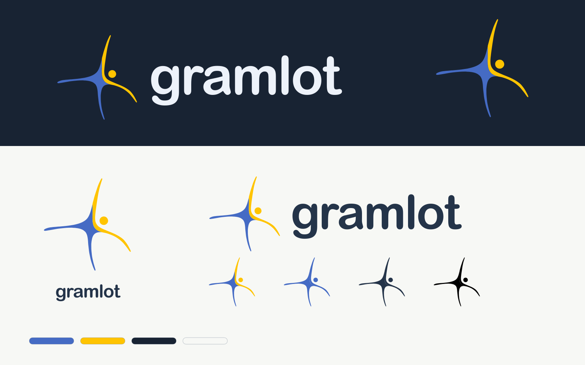

# Gramlot identity kit

**Open [the visual catalogue](index.html).** The complete ZIP (`../gramlot-brand-kit.zip`) is generated by [`source/build_assets.py`](source/README.md) and not committed.

Blue/yellow asymmetric symbol, detached disc and lowercase **gramlot** in outlined
Arial Rounded MT Bold. The identity and supporting palette were selected on
2026-09-18. The owner authorized completion of this kit on 2026-10-02; the new
vector reconstruction and compositions are delivered for visual review.

## Find the right file

| Directory | Contents |
| --- | --- |
| [source](source/README.md) | Single path-only SVG master and reproducible export script |
| [svg](svg/gramlot-logo-primary.svg) | Stacked logo, horizontal logo, symbol and wordmark; six transparent variants each |
| [png](png/gramlot-logo-primary-1024.png) | Transparent raster exports, widths 64–2048 px depending on composition |
| [icons](icons/README.md) | SVG/ICO/PNG favicons, Apple touch, Android, Safari mask, maskable icons and manifest fragment |
| [palette](palette/gramlot-palette.svg) | Approved colors in CSS, JSON, GIMP GPL and SVG |
| [social](social/gramlot-opengraph-dark.png) | Open Graph 1200 × 630, square 1080, banner 1500 × 500, portrait 1080 × 1350 and story 1080 × 1920; light/dark SVG and PNG |
| [backgrounds](backgrounds/gramlot-wallpaper-dark-2560.png) | Wallpapers at 1920/2560 px and 1920 × 1080 presentation backgrounds, light/dark |
| [preview](preview/gramlot-identity.svg) | SVG/PNG overview sheet |
| [print](print/gramlot-identity-guide.pdf) | Four-page printable identity guide with vector logo paths |
| [references (git history)](https://github.com/gramlot-org/gramlot/tree/234c6d8/assets/branding) | Original raster/hybrid artwork of 2026-09-18, commit `234c6d8`; not committed again |

[Full inventory and SHA-256 checksums](manifest.json).

## Variants and filenames

`gramlot-{form}-{variant}.{svg,png}` uses:

- `form`: `logo` (stacked), `horizontal`, `mark` (symbol), `wordmark` (lettering only).
- `variant`: `primary` (blue/yellow, ink lettering), `inverse` (blue/yellow, light lettering),
  `blue`, `ink`, `black`, `white` (one-color utility exports).
- PNG names end with their **pixel width**, for example `gramlot-horizontal-primary-1024.png`.

Every SVG in `svg/` is fully vector and transparent. All geometry comes from the
same master; light/dark versions share the exact symbol and lettering paths.
Use primary on light surfaces and inverse on navy. Monochrome exports support
one-color reproduction. Preserve proportions and leave one disc diameter of
clear space around visible artwork. Check narrow tips at the final display size.

The stable entry points `gramlot-logo.svg`, `gramlot-logo-dark.svg`,
`gramlot-mark.png` and `gramlot-mark-dark.png` retain their original white/navy
background use and composition, now rendered from the vector master.

## Guides and limits

[Graphic coordination guide](theme-guide.md) · [Palette reference](theme-reference.html) ·
[Approved tokens](theme-tokens.json) · [Text contrast calculations](contrast-check.json).

The symbol is a faithful vector reconstruction of the selected raster, with solid
approved colors and generated texture removed; original lettering paths are retained.
New artwork and layouts have not yet received owner visual acceptance. Font files
are not distributed. Print artwork uses RGB; CMYK/spot-color conversion depends
on the printer's production profile. Icon exports are working assets, not certified
minimum sizes. Supporting UI tokens are a specification, not installed runtime defaults.

The catalogue and social/background compositions are static graphic resources;
they are not Gramlot applications or examples. Existing documentation styling follows
the constitution's classic Read the Docs theme.
