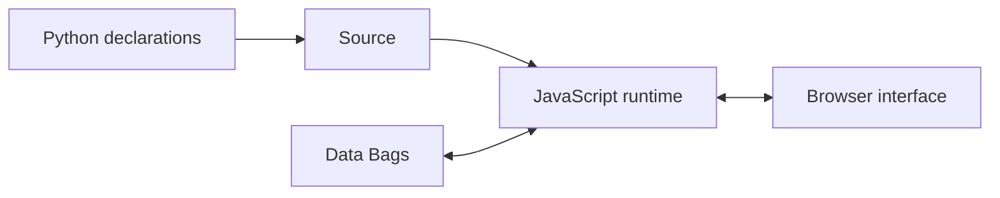
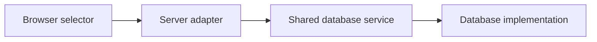

# Gramlot — overview

[Constitution](00-constitution.md). [Concise version](../docs_llm/01-overview.md).

## 1. Purpose

Gramlot is a framework for declarative application interfaces. Python describes
applications; a JavaScript runtime gives their declarations behavior in the browser.
Applications use a shared model for interface structure, data and interactions.
The core is independent of server and database technology; adapters connect it
to hosting environments and data services.

## 2. Source, Data and the browser

**Source** describes structure and behavior. **Data Bags** hold state used by
bindings and controllers. The **DOM** is the browser representation of the interface.
Bindings connect declarations to Data. Controllers react to changes and events;
resolvers provide data through their contracts. Not every Source node creates DOM.

### 2.1. Example: a bound input

Python declares a text input bound to a Data path. The runtime renders the control
and connects its value to that path. User edits and external Data changes follow
the binding contract; application code does not scrape the input or install a
parallel event and state system.

## 3. Building blocks

| Element | Responsibility |
| --- | --- |
| Component | Exposes a control through parameters, values, events and lifecycle |
| Controller | Reacts to Data and events and executes application behavior |
| Recipe | Composes ordinary Source nodes into a reusable structure |
| Service or handler | Implements shared behavior behind a defined contract |
| Mixin | Adds a reusable capability to a class |

Bases, mixins and collaborators compose concrete classes with explicit requirements,
lifecycle responsibilities, cleanup and instance isolation. Python authoring,
browser and server mixins operate at different layers.

### 3.1. Example: input capabilities

An input combines editing behavior with lifecycle, label presentation and field
state. Validation can be supplied by a shared service. The contract identifies
who writes Data and releases subscriptions when the control is removed; the
validation engine need not be duplicated in every control.

## 4. Application authoring

Applications use Python declarations and Gramlot Source, Data Bags, bindings,
controllers, resolvers and shared components. Small local JavaScript expressions
can complement these declarations. Reusable browser behavior belongs in the
framework's JavaScript services and components.

Application UI, state, events and requests use Gramlot mechanisms. Direct DOM
construction, manual event wiring and separate request/state machinery are not
application authoring mechanisms. Native browser operations belong inside the
framework implementation.

## 5. Server and database adapters

Server adapters connect pages and services to a host. Database adapters connect
shared database contracts to backend or application-model services. These choices
are independent: hosting a selector on FastAPI does not make database search
part of FastAPI.

Gramlot defines shared server-adapter responsibilities. FastAPI, Genro ASGI and
Django integration projects document their host-specific behavior.

### 5.1. Database responsibilities

The database architecture separates `common` contracts and behavior, a `fake`
implementation for controlled contract checks, and `genropy` and `sqlalchemy`
implementations. SQLite is a database usable through SQLAlchemy.

Capabilities comprise a required minimum, common optional capabilities and
implementation-specific extensions. Supporting the common contract does not imply
support for extensions. Advanced GenroPy capabilities retain their own boundary;
`auxColumns`, for example, belongs to that capability set.

### 5.2. Example: a database selector

A control delegates search to a database service through the host's request
integration. Shared database policy and backend access remain separate from the
visual control and host-specific handling.

The standard dbSelect search contract provides prefix search followed by
containment and supports both case-sensitive and case-insensitive matching.
Detailed component and adapter contracts specify parameters and result behavior.
