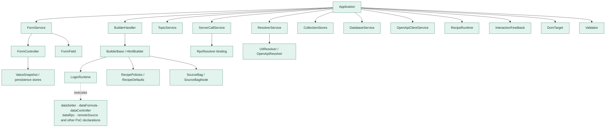
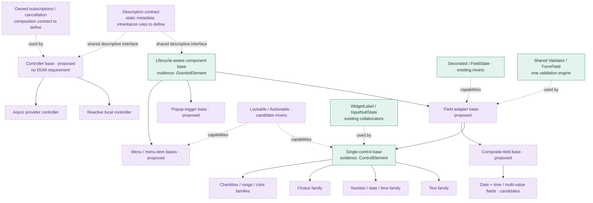
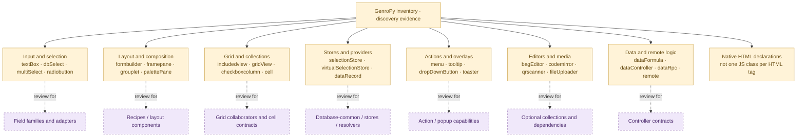
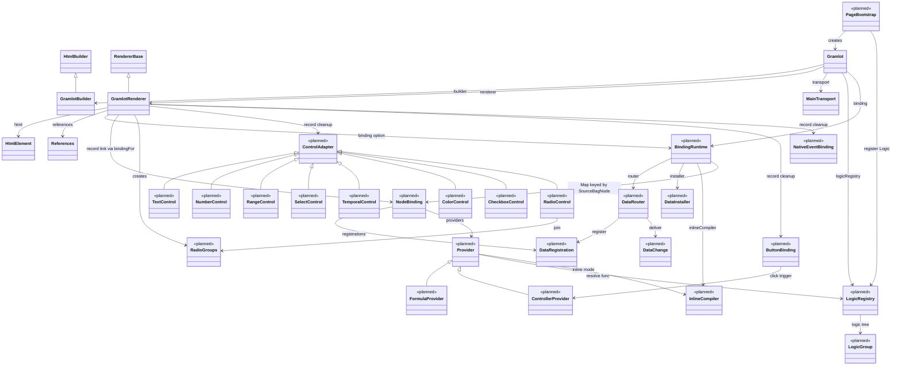

# JavaScript taxonomy, inheritance and composition

Document ID: **GC-045**. Status: **source inventory and design proposal; no new hierarchy approved**.

**Release scope:** sections 005–050 describe `gramlot-poc` evidence, not the core.
The core code is release **0.1.2**. Sections 055 and 060 describe the core runtime
classes: the current 0.1.2 classes, and the classes of the 0.2.0 HTML/SVG binding
plan. **The 0.2.0 parts are planned and not implemented.**

[Concise counterpart](../../docs_llm/internal/045-js-taxonomy.md).
[Complete inventory](050-js-taxonomy-census.md). [Full syntactic class tree](diagrams/045-all-classes.mmd). [Machine-readable evidence](inventory/045-js-taxonomy.json).

## 005 · Scope and reading key

Snapshot: `gramlot-org/gramlot-poc@10478b57ce3f22e6445eb6b72eba343520cbebac`.
Tree-sitter parsed **113 JavaScript/ES-module files**, finding **112 class
constructs and 2 functional mixins**, plus **138 module-level function declarations**.
The built-in catalogue has **38 descriptions in 10 collections**. Some classes are
local factories, anonymous custom elements, tools or stubs; these counts do not
represent 112 public component APIs. Exported arrow helpers are not included in
the function-declaration count; every scanned file is listed in the full inventory.

Legacy evidence comprises **390 cards** plus **6 curated current-contract cards**.
The legacy card categories are 341 components, 20 controllers, 17 internal/reference
helpers, 11 component/helpers and 1 recipe/registration contract. The original
coverage manifest reports 437 direct declarations and 310 registrations merged
into those cards. Its 40 name-level matches do not prove behavioral compatibility.
Legacy census coverage is of the two selected Python discovery trees, not every
GenroPy JS implementation. No dependencies, dynamically generated classes or other
Gramlot repositories are included in the JS source count.

Green: present in PoC source, not necessarily accepted core. Purple/dashed:
proposed contract or organization. Amber: legacy discovery evidence. In class
diagrams, `<|--` is inheritance, `..>` applies a mixin, and `-->` uses a collaborator.
Overview/legacy flowcharts group responsibilities; their arrows are not inheritance.
Do not turn every capability into a mixin or every Source tag into a JS class.

## 010 · Whole-system taxonomy

Collections, class inheritance and capabilities are separate axes. Public descriptive contracts should span appropriate exported element families, rather than force all runtime objects into one superclass.

```mermaid
flowchart TB
    ROOT["Gramlot JavaScript · responsibility map"]
    ROOT --> C["Visual components"]
    ROOT --> L["Controllers and declarative logic"]
    ROOT --> R["Recipes and authoring"]
    ROOT --> S["Services and collaborators"]
    ROOT --> D["Data and runtime infrastructure"]
    ROOT --> U["Library utilities"]
    ROOT --> T["Developer tools"]
    C --> CB["GramlotElement / ControlElement"]
    C --> CW["Controls · layouts · grids · trees · editors"]
    L --> LC["LogicRuntime · FormController"]
    L --> LD["dataFormula / dataController / dataRpc<br/>Source declarations, not separate JS classes"]
    R --> RB["BuilderBase → HtmlBuilder / SvgBuilder"]
    R --> RR["RecipeRuntime · Source expansions"]
    S --> SF["FormService · FormField · Validator"]
    S --> SN["TopicService · ServerCallService · ResolverService"]
    D --> DS["SourceBag / SourceBagNode · BuilderHandler"]
    D --> DB["Stores · database contracts · fake adapter"]
    U --> UF["Pointers · formatting · parsing · expression helpers"]
    T --> TI["Inspector · LabSession · DeveloperTools"]
    COL["Collections<br/>distribution and registration axis"] -. groups .-> CW
    MIX["Decorated / FieldState<br/>existing functional mixins"] -. applied to .-> CB
    CAP["Candidate capabilities<br/>lock state · actions · popup ownership"] -. proposed .-> C
    META["Proposed description contract<br/>JS metadata → generated JSON → Python"] -. describes public elements .-> C
    META -. describes public elements .-> L
    classDef root fill:#15324f,color:#fff,stroke:#15324f;
    classDef existing fill:#e3f3ed,color:#143d2e,stroke:#39866b;
    classDef proposal fill:#f0e8fa,color:#4f2e70,stroke:#9670b3,stroke-dasharray:5 4;
    class ROOT root;
    class C,L,R,S,D,U,T,CB,CW,LC,LD,RB,RR,SF,SN,DS,DB,UF,TI,COL,MIX existing;
    class CAP,META proposal;
```

## 015 · Existing component inheritance and actual mixins

`getComponentBases(Element)` creates realm-specific bases. In inputs.js, `GnrInput` is an alias for `ControlElement`. The exact control expression is `FieldState(Decorated(GramlotElement))`; the diagram compresses these wrappers but preserves their order in the labels. GroupBox separately applies Decorated.

Factory-produced `GnrDbSelect` and `GnrCheckBoxText` extend an argument named
`Base`; the census retains that expression rather than guessing a global parent.
Their concrete call sites must determine the parent and variants during porting.
Similarly, `dbSelect`, `remoteSelect` and `callbackSelect` are catalogue identities,
not proof of three independently declared implementation classes.

## 020 · Components not yet on the common lifecycle base

These source classes directly extend HTMLElement. Grouping them into future common bases would be a refactoring proposal, not a description of current inheritance. ProseEditorAnonymous and MarkdownEditorAnonymous label anonymous registered classes. Grid collaborators are composed objects, not mixins.

```mermaid
classDiagram
    direction TB
    HTMLElement <|-- GnrPanel
    HTMLElement <|-- GnrBox
    HTMLElement <|-- GnrBorderContainer
    HTMLElement <|-- GnrTab
    GnrTab <|-- GnrContentPane
    HTMLElement <|-- GnrTabContainer
    GnrTabContainer <|-- GnrStackContainer
    HTMLElement <|-- GnrStackButtons
    HTMLElement <|-- GnrFormlet
    HTMLElement <|-- GnrLabledBox
    HTMLElement <|-- GnrForm
    HTMLElement <|-- Palette
    HTMLElement <|-- CopyButton
    HTMLElement <|-- FrameChannel
    HTMLElement <|-- GnrStoreTree
    GnrStoreTree <|-- GnrRelationTree
    GnrStoreTree <|-- FileSystemTree
    HTMLElement <|-- GnrGrid
    HTMLElement <|-- Chart
    HTMLElement <|-- CodeMirrorElement
    HTMLElement <|-- GramlotIde
    HTMLElement <|-- GramlotInspector
    HTMLElement <|-- ProseEditorAnonymous
    HTMLElement <|-- MarkdownEditorAnonymous
    GnrGrid --> GridInteractions
    GnrGrid --> GridBands
    GnrGrid --> GridEditor
    GnrGrid --> GridStatus
    GnrGrid --> GridChangeManager
```

## 025 · Runtime, controllers and services

This section is PoC evidence. The planned core runtime for 0.2.0 is in §055, not in this diagram.
Arrows here mean assembly or use, not inheritance or a claim of exclusive ownership. Logic declarations are executed by LogicRuntime and collaborating services; the source does not contain a generic GramlotController base with one subclass for every declaration. FormController and InspectorController are existing specialized controllers.

## 030 · Data, builders, renderers and resolvers

These are the observed inheritance relationships. Bag, BagNode and BagResolver belong to external dependencies; Error and HTMLElement are platform types. Database classes are PoC evidence, not acceptance of dataRecord, dataSelection or the general capability protocol. MemoryStore, form stores, CollectionStores and database BaseStore have distinct responsibilities and must not be merged merely because they contain “store”.

## 035 · Candidate consolidation tree

Based on the earlier browser architecture review and current evidence. All new family/base names and mixins remain proposals. A shared descriptive interface does not imply a single root superclass above both DOM components and nonvisual controllers. The proposed AST/CI exporter is not yet verified; GC-040 tested a JS-executed metadata exporter, not AST extraction of descriptions.

| Capability | Current carrier | Proposed treatment |
| --- | --- | --- |
| Connection/disconnection cleanup | GramlotElement | Keep a small lifecycle contract; test errors and reconnection. |
| Label decoration | Decorated + WidgetLabel | Mixin installs the shared collaborator. |
| Field error presentation | FieldState + helper functions | Thin adapter; keep validation policy elsewhere. |
| Null versus empty | InputNullState | Composed state machine, not universal superclass state. |
| Typed number/date editing | NumberEditor / SymbolicDateEditor | Collaborators with explicit value/commit contracts. |
| Validation and draft policy | FormField / Validator / FormService | Shared engine; avoid duplicating it into each mixin. |
| Disabled/read-only forwarding | Existing control implementations | Candidate Lockable capability after contract comparison. |
| Commands and popup ownership | Scattered component/runtime behavior | Candidate Actionable/anchored-popup contracts after two real consumers agree. |
| Binding and Data writes | Builder / Source / Application boundary | Keep ownership explicit; do not install another binding engine per component. |
| Async cancellation | RPC, resolvers, form operations | Review common ownership contract; not yet one mixin. |
| Metadata/description | Existing catalogue; GC-040 experiment | Propose static descriptive contract and generated JSON. |
| Utilities | Pointer, date, number, formatting, expression modules | Functions where stateless; do not invent inheritance for reuse. |

## 040 · GenroPy families feeding the design

This is a curated grouping of representative legacy identities, not a compatibility matrix. Every one of the 390 cards remains available in the complete inventory with its recorded category/status. Some syntactic “component” cards describe composition helpers; classification needs behavioral review before selecting a class family.

## 045 · Collections and third-party extension

Current catalogue groups are listed below. A package/collection can contain several class families; a base class can support controls in different collections. Non-catalogued JS elements and helpers remain visible in the full class/file census.

| Collection | Declared elements |
| --- | --- |

| `inputs` | `textBox`, `textBoxArea`, `checkBoxText`, `filteringSelect`, `dbSelect`, `remoteSelect`, `callbackSelect`, `comboBox`, `passwordbox`, `numberTextBox`, `dateTextBox`, `timeTextBox`, `horizontalSlider`, `verticalSlider`, `checkbox`, `dateCalendar` |
| `colorpicker` | `colorpicker` |
| `layout` | `formlet`, `labledBox`, `panel`, `box`, `borderContainer`, `tabContainer`, `tab`, `contentPane`, `stackContainer`, `stackButtons`, `groupBox` |
| `clipboard` | `copyButton` |
| `palette` | `palette` |
| `storeTree` | `storeTree`, `relationTree`, `fileSystemTree` |
| `forms` | `form` |
| `labEditors` | `codeMirror`, `gramlotIde` |
| `grid` | `grid` |
| `chart` | `chart` |

A third-party collection should declare identity/version, exported classes and
metadata, dependencies and assets. The exporter produces JSON for Python; browser
implementations remain JS. Flat Python names and global custom-element tags need
collision rules even when collection IDs are namespaced. See
[GC-040](040-js-owned-components.md) for the bounded extension experiment and gaps.

## 050 · Sources, regeneration and next review

Regenerate machine evidence with `python scripts/inventory_js_taxonomy.py /path/to/gramlot-poc` using Python with `tree-sitter` and `tree-sitter-javascript`. The script parses syntax without executing JS and fails on syntax errors. Dependency versions used for this snapshot are recorded in the evidence JSON. A reviewer curates diagram relationships; a successful parse does not prove lifecycle behavior.

Evidence: PoC `js/dom/src/components/bases.js`, `collections/inputs.js`, `collections/layout.js`, `application.js`, `forms/`, `database/`, and `gramlot_inventory/README.md`, `legacy-census/coverage-manifest.md`; historical proposal `docs/development/gramlot-components-architecture-review-2026-09-11.md` and guide `docs/guides/component-controller-recipe-management.md`.

Before implementation, select the first component/controller families, define mixin ordering and member conflicts, agree composition/disposal ownership, and test the static metadata contract including inherited/mixin descriptions. Legacy-only capabilities remain candidates; core acceptance proceeds through bounded ports. No formal Live Object Tree semantics are inferred. These internal documents remain excluded from public Sphinx staging.

## 055 · Core runtime classes: current 0.1.2 and planned 0.2.0

**Status: the 0.2.0 part is planned and not implemented. The current code is 0.1.2.**
Source of the 0.2.0 part: the owner-confirmed binding plan of 2026-09-25
(revision 3; approved by the owner on 2026-09-25, proposals confirmed "for now"). Phase S00 records it in the repository
as GC-210 and as a constitution amendment; neither exists yet. Use
[GC-070](070-work-status.md) for status. This section describes the core
repository, not `gramlot-poc`.

**Current 0.1.2 (`js/src`):**

- `Gramlot` (`gramlot.js:8-112`) creates `GramlotBuilder`, sets `data = builder.data`,
  writes an empty `main` Bag inside `builder.data` (`gramlot.js:14`), then creates
  `GramlotRenderer` and `MainTransport`. It has no Data subscription and no binding.
- `GramlotRenderer extends RendererBase` (`renderer/gramlot-renderer.js`) owns the
  node → record `Map` (line 20), the element → record `WeakMap` (line 25), one Source
  subscription (line 27) and the `pending` FIFO in `receive` (lines 199-229). It
  filters frozen nodes before queuing (lines 201-205).
- `HtmlElement` (`view/html.js`) creates and updates native HTML/SVG elements. It
  also writes the `value` property of controls (`html.js:131-134`).
- `References` (`references.js`) and `MainTransport` (`transport.js`) are collaborators.
- `GramlotBuilder extends HtmlBuilder` (`builder/gramlot-builder.js`); `computeLogic()`
  is empty (line 17). Authoring stays inert.

**Planned 0.2.0 files and classes:**

| File | Classes and exports | Phase |
| --- | --- | --- |
| `js/src/binding/runtime.js` | `BindingRuntime`, `NodeBinding` | S03 |
| `js/src/binding/router.js` | `DataRouter`, `DataRegistration`, `DataChange` | S04 |
| `js/src/binding/installation.js` | `DataInstaller` | S05 |
| `js/src/binding/providers.js` | `Provider`, `FormulaProvider`, `ControllerProvider` | S08 |
| `js/src/binding/logic.js` | `LogicRegistry`, `LogicGroup` | S07 |
| `js/src/binding/inline.js` | `InlineCompiler` | S09 |
| `js/src/view/controls.js` | `ControlAdapter` and subclasses, `RadioGroups` | S10, S11 |
| `js/src/view/button.js` | `ButtonBinding` | S12 |
| `js/src/view/events.js` | `NativeEventBinding` | S12 |
| `js/src/bootstrap.js` | `PageBootstrap` | S07 |
| `js/src/adapters/resources.js` | `ResourceResolver`, `parseRequires` | S06 |
| `src/gramlot/server/resources.py` | `ResourceResolver`, `parse_requires` | S06 |
| `src/gramlot/collections/binding.json` | grammar of data-elements and binding attributes | S02 |

There is no `operations.js`. Code writes Data through the Builder Source node methods
(`setRelativeData`, `getRelativeData`, `SET`, `GET`, `PUT`, `FIRE`, `FIRE_AFTER`).

**Planned composition rules:**

- Construction order in the `Gramlot` constructor: `LogicRegistry(this)` →
  `GramlotBuilder` → `BindingRuntime(this)` → `data = builder.data` →
  `binding.attach()` → `source = builder.source` →
  `GramlotRenderer(builder, source, destination, {binding})`.
- The current line `this.data.setItem('main', new Bag())` (`gramlot.js:14`) disappears.
- `binding.attach()` sets `main` of an outer Data root to the document Bag without a
  copy, and subscribes once to the outer root. `gramlot.data === builder.data`.
  Author paths never contain `main`. `DataRouter` is the only subscriber of the outer root.
- Parent passes `this` to the child; the child exposes it with a getter (`runtime`,
  `binding`, `gramlot`). State lives in instances only.
- No `SourceBagNode` subclass and no prototype change (P17). Semantic state lives in
  `NodeBinding`, stored in a `Map` of `BindingRuntime` keyed by the `SourceBagNode`.
- Semantic lifetime is `NodeBinding`: registrations, providers, timers, click counter,
  stamps (`installed`, `init`, `built`, `start`) and the `remoteSource` request.
- DOM lifetime stays the renderer record (`record.cleanup`, `gramlot-renderer.js:84`):
  element, listeners, `ControlAdapter`, `ButtonBinding`, `NativeEventBinding`.
  A rebuild of the same node closes only the DOM lifetime.
- Registrations happen at step 4 of the branch installation (§060), before the DOM.
  `renderedItem` only links the renderer record to the `NodeBinding` already opened
  (`binding.bindingFor(node)`). `renderer.project(node, change)` does nothing while
  the node has no record yet (steps 4-5, or under freeze).
- `BindingRuntime` owns `InlineCompiler` (`get inlineCompiler()`). Attributes with
  `==` are evaluated by `NodeBinding.evaluateFormulas()` through
  `InlineCompiler.compileExpression`, at every projection.
- The renderer creates `RadioGroups` (`constructor(renderer)`); it stays in the view
  layer. `BindingRuntime` has no `radioGroups`, so `binding/` does not import `view/`.
- `FormulaProvider` and `ControllerProvider` extend `Provider`. `dataSetter` is not a
  provider: `DataInstaller` owns it.
- `func` resolves through `LogicRegistry.resolve`, not through Builder's
  `_resolveLogicFunc`, which looks up static methods only. `GramlotBuilder` does not change.
- `LogicGroup` has one own member, `page`. `gramlot.logic` is the root group with
  the companion methods; each `js_requires` name is a child group; a name with `/`
  is a nested group.
- `GramlotRenderer` and `Gramlot` gain `getBaseSourceNode(domNode)` and
  `getDomNode(sourceNode)`, built on the existing `records` and `elements` maps.
  No property is added to Source nodes or DOM elements.

Diagram source: [045-core-runtime-0.2.0.mmd](diagrams/045-core-runtime-0.2.0.mmd).
`<<planned>>` marks classes that do not exist in 0.1.2. Arrows `-->` are use or
ownership; `<|--` is inheritance.

## 060 · Planned 0.2.0 runtime sequences

**Status: planned and not implemented. The current code is 0.1.2.**

**Branch installation (P2, P3, P5).** It applies to `mountMainSource`
(`gramlot.js:56-62`), to `remoteSource` (`gramlot.js:87`) and to every Source event
that brings a new branch. Installation starts from `BindingRuntime.handleSourceEvent`,
inside the renderer FIFO.

1. Validation of the whole branch, without effects (`renderer.validateCandidate`).
2. `dataSetter` nodes in document order, parent before children; `applySetter` on each (rule R1).
   Observers already active receive these writes synchronously.
3. Defaults (`default`, `default_value`, `default_<attr>`) on empty paths only. Then
   `attr_<name>=v`, as in legacy, sets attribute `<name>` on the Data node of the
   control's `value` (or `src`) path, only if that Data node exists, without an
   emptiness check. `v` can be a pointer. A default just written creates the Data node.
4. Registration: `openBinding` per node; `registerPointers` for visual nodes;
   `Provider.register` for `dataFormula` and `dataController`.
5. `_init`, once per node, invoked by `BindingRuntime`.
6. DOM build with the current values. Under freeze this step waits for the thaw.
7. `_onBuilt`, after the first successful build.
8. `_onStart`: after page readiness for the initial Source; right after step 7 for a
   branch inserted later. A node never built keeps waiting.

On error the new `NodeBinding` objects close. Data are not rolled back. Under freeze,
steps 1-5 run at once; DOM and `_onBuilt` run at the thaw (P3).

**Source event entry (P4).** Current 0.1.2 `receive` filters frozen nodes before
queuing (`gramlot-renderer.js:199-229`). The planned entry is:

1. If the renderer is disposed, return. Otherwise push the event on `pending`.
   If a build is running, return.
2. Process `pending` one event at a time, in arrival order:
   - an event whose node is no longer attached to the Source is dropped, except `del`;
   - an event on a node under construction is ignored, as in legacy;
   - semantic work, always, also under freeze: `binding.handleSourceEvent(event)`;
   - structural work (`insert`, `remove`, `update`) only outside a frozen branch.
3. An exception empties `pending` and propagates, as in 0.1.2.

Source mutations made during semantic work (by `_init`, an observer or a provider)
enter the FIFO and run after the current event.

| Source event | Planned semantic work |
| --- | --- |
| `ins` | `installer.install(node)` |
| `del` (node or array) | `closeBranch` of each node |
| `upd_value`, old value `SourceBag` | `closeBranch` of the children of `event.oldvalue` |
| `upd_value`, new value `SourceBag` | `installer.install(new value)` |
| `upd_value`, new scalar or null | only closure of the old branch, if any |
| `upd_attrs` | `rebind()` of the node; `rebindBranch(node)` if `attrs_diff` touches `datapath`, `_anchor`, `node_id`, `form` or `formId` |
| `upd_value_attr` | old branch closure, then `upd_attrs`, then new branch installation |

**Data write.** A write reaches the document Bag; the event propagates to the outer
root with `pathlist` starting with `main`; `BindingRuntime.receiveData` calls
`DataRouter.deliver`; the router computes path, level (`node`, `container`, `child`)
and `fired`, copies the candidates and calls `recipient.receive(change)`.
`NodeBinding.receive` calls `renderer.project(node, change)`, which does nothing if
the node has no element yet; `Provider.receive` calls `invoke`. A fired event at level `child` is not delivered. `reason === 'autocreate'` is ignored.

**Removal and freeze.** A Source `del` closes the branch semantically, also under
freeze. Thaw builds the current Source once, with no reinstallation and no repeated
`_init` or `_onStart`.

**Planned authoring semantics used by the runtime:**

- Symbolic paths already resolved by Builder: `#parent`, `#FORM` (first ancestor with
  `formId` or `form=True`), `#ANCHOR` (first ancestor with `_anchor`), `#<node_id>`.
  Legacy `#WORKSPACE`, `#ROW`, `#DATA` are out of 0.2.0.
- Button click mechanisms, one per button (P10): nested `dataController` (primary);
  `action='…'` (inline code, `this` = button node, page runtime only); `fire='.path'`
  (`FIRE` with the modifier string or `true`; the Data node gets `modifier` and
  `_counter`); `fire_<name>='.path'` (`FIRE` with value `'<name>'`; several fire in
  attribute order). A combination of controller, `action` and the `fire` family is an error.
- Control attributes do not enter `kwargs`: `destination_path`, `result_path`,
  `func`, `formula`, `script`, `_if`, `_else`, `_init`, `_onStart`, `_onBuilt`,
  `_delay`, `_timing`, `_userChanges` (P20).

**Upstream dependencies, not existing features.** These fixes belong to the owning
libraries (constitution §14). They are not in the installed Builder JS 0.1.5 or Bag JS 0.5.3:

- **U1, genro-builders:** `setRelativeData` with reason `false` writes without
  notifying anyone. Today `PUT` emits the event. Required before S08.
- **U2, genro-bag:** the update event carries `fired`. Today it does not. The router
  reads `fired` from the event after U2. Required before S08.
- **U3, genro-builders:** a `delay` parameter in `setRelativeData` and
  `FIRE_AFTER(path, value = true, delay = 10)` on the Source node. Required before S08.
- **U4, genro-builders:** `absDatapath` resolves a variable datapath
  (`datapath='^.foo'`) by reading the Data. Today `_composeRelativeDatapath` uses the
  raw value. Required before S04.
