# Gramlot: architettura e guida per collaborare

> **0.2.0 contract update — 2026-09-25:** initial values use
> `dataSetter(destination_path, value=None, **attr)`, not the legacy data declaration;
> `dataFormula(result_path, formula=None, func=None, **params)` and
> `dataController(script=None, func=None, **params)` are the canonical logic signatures.
> See [GC-210](210-binding-contract.md). This is a planned contract, not delivered
> binding; historical component examples and standalone HTML exports retain their
> dated scope and do not establish 0.2.0 support.


**Edizione storica del 18 settembre 2026.** Il core attuale implementa il perimetro limitato HTML nativo e Source live; PoC, binding e ricette restano evidenza o lavoro futuro. Per lo stato corrente vedere [GC-070](070-work-status.md) e per la release [GC-110](110-native-html-readiness.md#gc-110-020).

**GC-055 · Edizione di lavoro · 18 settembre 2026**

Dalle dichiarazioni Python ai componenti JavaScript: responsabilità, composizione,
collezioni e percorso verso il core consolidato.

Guida interna in italiano richiesta dal proprietario. Le proposte sono indicate
come tali; il codice di riferimento è ancora nel PoC.

<a id="gc-055-005"></a>

## 005 · Da dove partire

Gramlot è un framework per descrivere interfacce applicative soprattutto in Python
e farle funzionare attraverso un runtime JavaScript nel browser. Il suo punto di
raccordo è **Source**, una struttura dichiarativa che descrive l’interfaccia e il
comportamento richiesto; lo stato applicativo vive nei **Data Bag**.

Il repository `gramlot` è la destinazione della versione definitiva e consolidata.
Per il momento l’implementazione è in `gramlot-poc`: contiene runtime, authoring,
esempi e test da esaminare e trasferire per incrementi verificati. Il consolidamento
comprende codice, contratti, test e documentazione, non soltanto lo spostamento di file.

Questa guida serve a chi deve contribuire al framework, costruire componenti o
realizzare integrazioni. Non è un manuale di installazione né una promessa di
compatibilità con tutto GenroPy. La direzione architetturale e i risultati già
osservati sono distinti dalle scelte ancora aperte.

| Etichetta | Come leggerla |
| --- | --- |
| **Esistente nel PoC** | Il codice è presente nella revisione esaminata; non equivale ad accettazione nel core. |
| **Esperimento verificato** | Un percorso delimitato ha superato i test indicati. |
| **Proposta** | Organizzazione o API da discutere prima del consolidamento. |
| **Evidenza legacy** | Funzionalità individuata nell’inventario GenroPy, da confrontare nel dettaglio. |

La costituzione del prodotto resta il riferimento per confini e responsabilità.
Non sono state approvate semantiche formali per il termine «Live Object Tree».

<a id="gc-055-010"></a>

## 010 · Source, Data e DOM: tre responsabilità

**Source** descrive che cosa deve esserci nella pagina: controlli, contenitori,
parametri e dichiarazioni di comportamento. **Data** contiene i valori con cui
lavora l’applicazione. **DOM** è la rappresentazione concreta prodotta nel browser.

Un campo di testo è un elemento visuale. Una formula dichiarata in Source può
invece aggiornare un valore nei Data senza produrre alcun elemento DOM. Per questo
«nodo Source», «componente visuale» e «oggetto JavaScript» non sono sinonimi.

Il binding collega una dichiarazione a un percorso nei Data. Un controller reagisce
ai cambiamenti o agli eventi; un resolver procura dati attraverso il proprio
contratto. L’applicazione usa questi meccanismi senza costruire una seconda gestione
di stato, eventi o richieste accanto al framework.

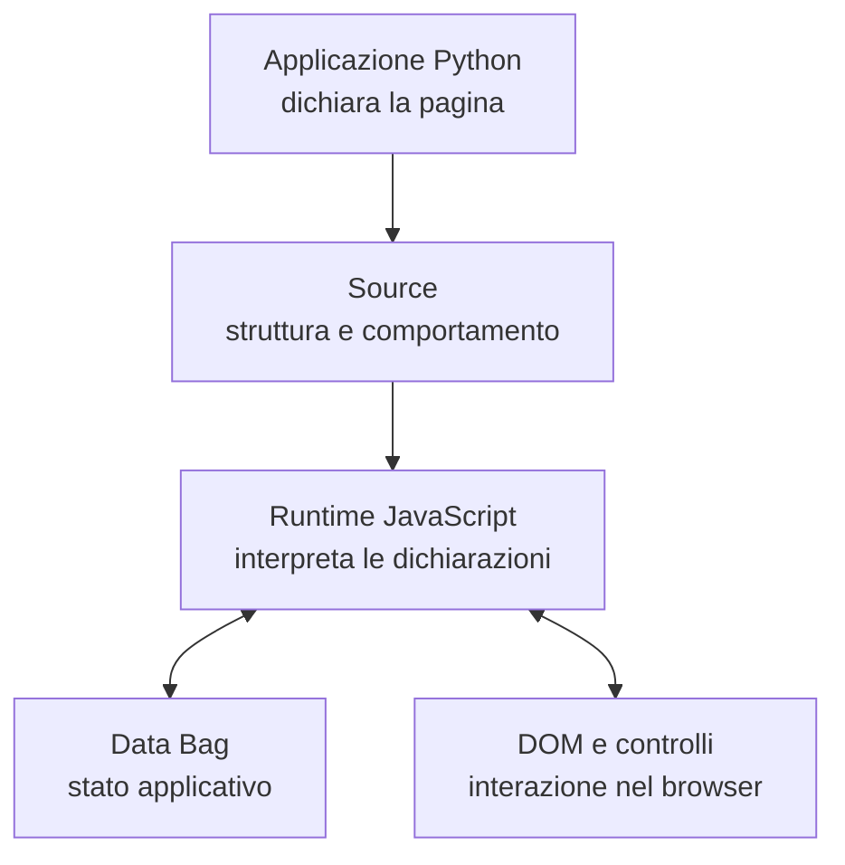

<a id="gc-055-015"></a>

## 015 · Che cosa succede quando si usa una pagina

Nel percorso con server, Python costruisce Source; il trasporto tipizzato lo rende
leggibile dal runtime JS. Il browser carica le implementazioni dei componenti
richiesti e collega i loro valori ai Data. Il server adapter si occupa dell’integrazione
con il proprio host: routing, documenti iniziali, risorse e invocazioni.

Dopo il caricamento, molte interazioni sono locali al browser. La modifica di un
campo non implica automaticamente una nuova esecuzione Python o un salvataggio
nel database. Una chiamata remota avviene quando una dichiarazione o un servizio
la richiede esplicitamente.

The historical component example below now uses the planned 0.2.0 dataSetter
spelling. textBox remains PoC component evidence, outside the native 0.2.0 scope;
this fragment is not an executable example of the current core:

```python
pane = root.div(datapath="persona")
pane.dataSetter(".nome", "Ada")
pane.textBox(value="^.nome", lbl="Nome")
pane.div("^.nome")
```

`^` indica una dipendenza reattiva secondo il contratto del binding. L’effettivo
momento in cui un controllo scrive il dato dipende dal suo contratto di commit:
per esempio, nel controllo usato nell’esperimento il valore viene confermato su
`change`. Il runtime, non la pagina, collega l’evento alla scrittura nei Data.

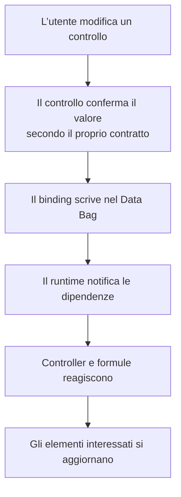

<a id="gc-055-020"></a>

## 020 · Una tassonomia per orientarsi

Per collaborare è utile chiedersi anzitutto quale responsabilità abbia un oggetto.
La sua cartella, la collezione che lo distribuisce e la sua classe base sono tre
informazioni diverse.

| Famiglia | Responsabilità | Esempi nel PoC |
| --- | --- | --- |
| Componenti | Espongono controlli visuali con valori, eventi e ciclo di vita. | `GnrTextBox`, `GnrGrid`, `GnrStoreTree` |
| Controller e logica | Reagiscono a Data ed eventi e coordinano comportamento. | `LogicRuntime`, `FormController`, `InspectorController` |
| Builder e recipe | Costruiscono o compongono dichiarazioni Source. | `BuilderBase`, `HtmlBuilder`, `RecipeRuntime` |
| Servizi | Forniscono funzionalità condivise con responsabilità esplicite. | `TopicService`, `ServerCallService`, `ResolverService` |
| Collaboratori | Incapsulano un comportamento usato da altri oggetti. | `WidgetLabel`, `InputNullState`, `NumberEditor` |
| Dati e infrastruttura | Gestiscono strutture, rendering, store e contratti dati. | `SourceBag`, `BuilderHandler`, `RendererBase`, `ReadAdapter` |
| Utility | Eseguono operazioni comuni, spesso senza stato proprio. | Parsing dei pointer, formattazione, conversioni |
| Strumenti | Aiutano a osservare, modificare e comprendere il runtime. | Inspector, laboratorio, strumenti sviluppatore |

Non occorre una classe diversa per ogni nome dichiarabile in Python. Nel PoC
`dataFormula` e `dataController` sono dichiarazioni eseguite da `LogicRuntime`,
non due sottoclassi di una base generale `GramlotController` già esistente.

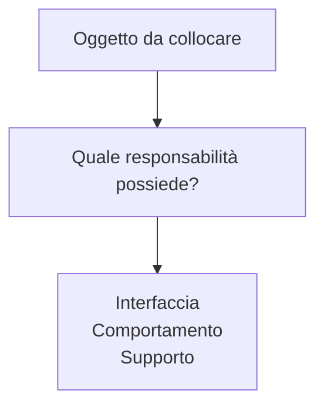

<a id="gc-055-025"></a>

## 025 · Classi base: il nucleo visuale esistente

Nel PoC `getComponentBases(Element)` restituisce basi legate al costruttore DOM
dell’ambiente corrente. `GramlotElement` gestisce connessione, disconnessione e
risorse associate alla connessione. `ControlElement` aggiunge la struttura di un
controllo nativo, il valore, la decorazione e la presentazione dello stato.

L’espressione effettiva è:

```javascript
class ControlElement extends FieldState(Decorated(GramlotElement)) { /* ... */ }
```

`Decorated` viene applicato per primo, `FieldState` all’esterno. In `inputs.js`
il nome locale `GnrInput` è un alias di `ControlElement`. Nel diagramma seguente
le caselle finali raggruppano sottoclassi reali; non introducono nuove classi base.

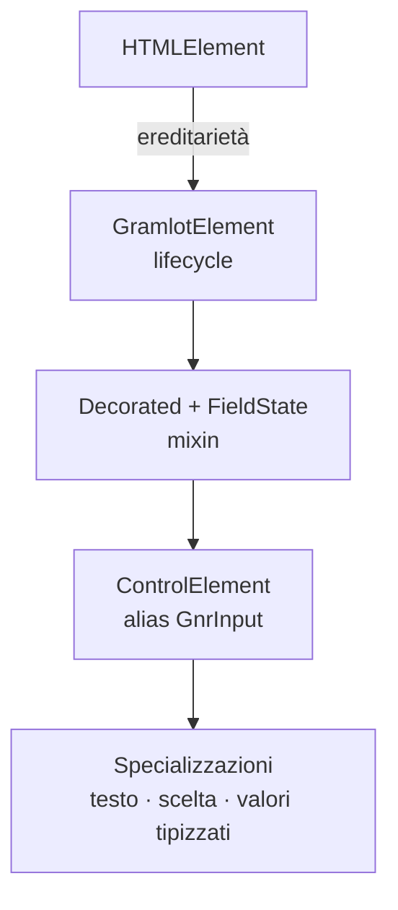

<a id="gc-055-030"></a>

## 030 · Specializzazioni e componenti ancora separati

Alcune relazioni sono già esplicite: `GnrFilteringSelect` specializza
`GnrComboBox`; `GnrVerticalSlider` specializza `GnrHorizontalSlider`.
Altri controlli che derivano da `ControlElement` sono password, checkbox e colore.
`DateCalendar` deriva da `GramlotElement`; `GroupBox` applica `Decorated` a quella base.

Numerosi componenti non passano ancora dalle basi comuni: contenitori, griglia,
albero, palette e vari editor derivano direttamente da `HTMLElement`.
Non va quindi rappresentato come già realizzato un unico albero omogeneo.

| Famiglia esistente | Relazioni o esempi |
| --- | --- |
| Contenitori | `GnrTabContainer → GnrStackContainer`; `GnrTab → GnrContentPane` |
| Layout autonomi | `GnrPanel`, `GnrBox`, `GnrBorderContainer`, `GnrFormlet`, `GnrLabledBox` |
| Alberi | `GnrStoreTree → GnrRelationTree / FileSystemTree` |
| Collezioni visuali | `GnrGrid`, `Chart` |
| Azioni e finestre | `CopyButton`, `Palette` |
| Editor e strumenti | `CodeMirrorElement`, `GramlotIde`, `GramlotInspector`, editor Markdown/HTML |

Le classi prodotte da factory, come `GnrDbSelect` e `GnrCheckBoxText`, ricevono una
base come parametro: occorre seguire i punti di costruzione prima di consolidarne
l’ereditarietà. Il solo nome del controllo non basta.

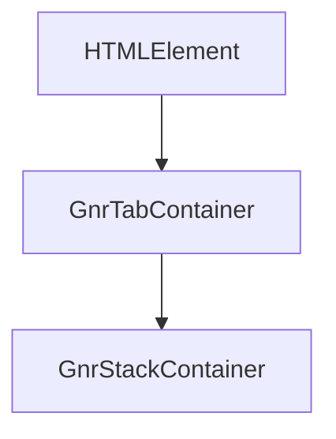

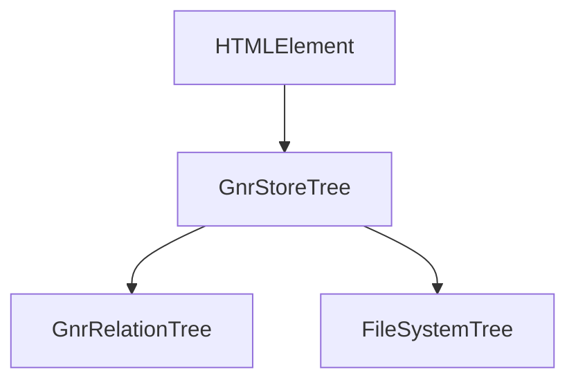

<a id="gc-055-035"></a>

## 035 · Mixin, collaboratori e utility: come scegliere

Un **mixin** aggiunge capacità a una classe e partecipa alla sua composizione.
Un **collaboratore** è un oggetto usato dalla classe, con un contratto proprio.
Un’**utility** è una funzione comune; non richiede ereditarietà per essere riusata.

Nel codice esaminato i due mixin funzionali sono `Decorated` e `FieldState`.
`WidgetLabel`, `InputNullState`, `ControlTools`, `NumberEditor` e
`SymbolicDateEditor` sono invece collaboratori. `Validator` è parte del sistema
condiviso di validazione: non va duplicato dentro ogni input.

Per introdurre un mixin occorre definire quali membri richiede e fornisce, quali
metodi può ridefinire, l’ordine di applicazione e il comportamento di cleanup.
Due mixin non devono sovrascrivere silenziosamente lo stesso callback. Per un
collaboratore servono un proprietario, una durata e un responsabile del rilascio
di listener, timer, sottoscrizioni o richieste.

Le funzioni comuni si raccolgono per responsabilità: conversioni, parsing,
formattazione, normalizzazione degli errori. Le dipendenze dal browser devono
restare riconoscibili; non tutto il codice condiviso deve dipendere dal DOM.

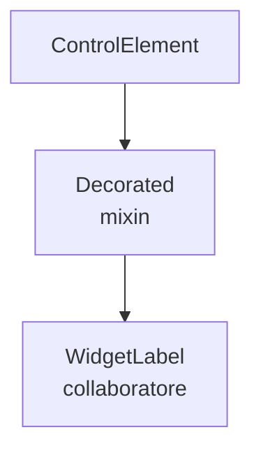

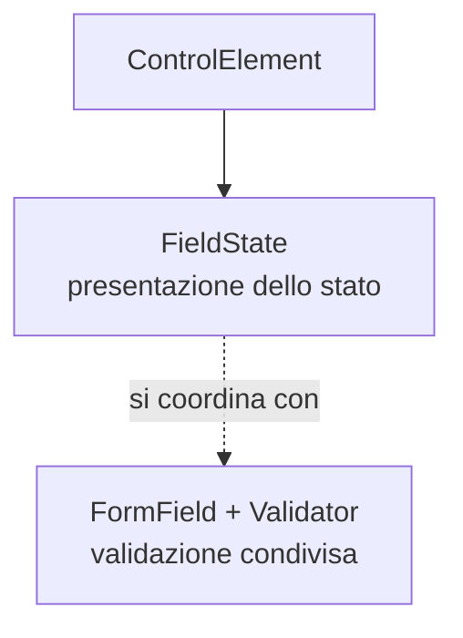

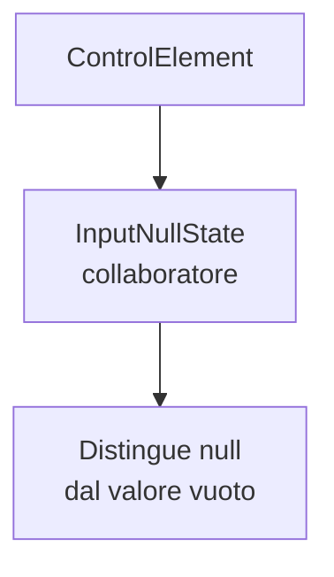

<a id="gc-055-040"></a>

## 040 · Controller, servizi e operazioni asincrone

`Application` assembla il contesto runtime: builder, servizi, target DOM e gestione
delle interazioni. `BuilderHandler` coordina Source e Data. `LogicRuntime`
installa ed esegue la logica dichiarativa; controller specializzati gestiscono
responsabilità come la form o l’Inspector.

Le richieste remote appartengono a `ServerCallService`; i resolver hanno contratti
di risoluzione e durata. Il sistema deve sapere chi possiede ogni richiesta e che
cosa succede se il nodo viene rimosso o sostituito mentre la risposta è in viaggio.
La cancellazione e il rifiuto dei risultati ormai superati sono parte del contratto,
non dettagli da risolvere diversamente in ogni componente.

Una base generale per i controller è ancora una proposta. Prima di implementarla
occorre confrontare attivazione, trigger, scritture nei Data, rientranza, errori e
cleanup delle famiglie esistenti. Un controller non deve avere bisogno di un DOM
solo perché un componente visuale lo possiede.

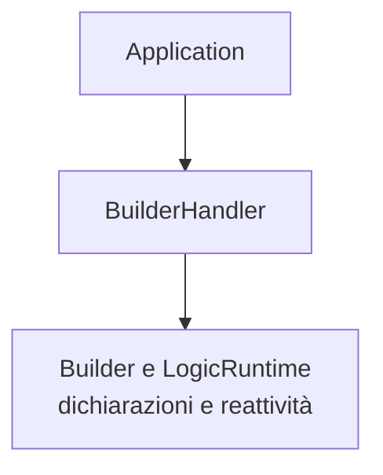

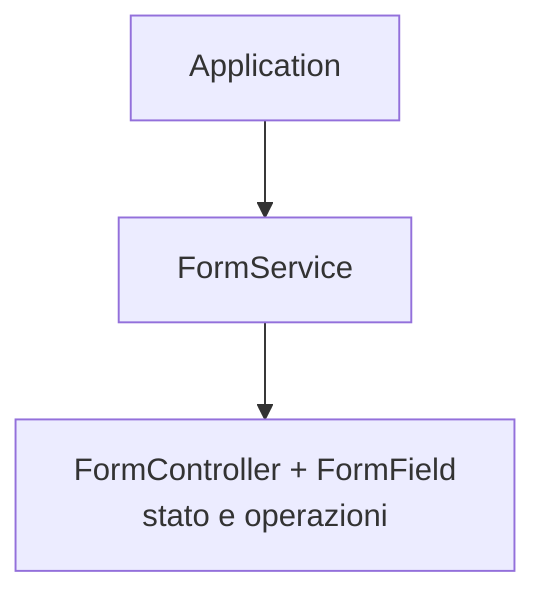

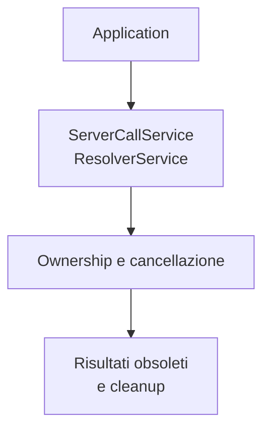

<a id="gc-055-045"></a>

## 045 · Componenti scritti in JS, applicazioni scritte in Python

La direzione discussa è che il componente sia definito una sola volta in JS:
implementazione e descrizione pubblica vivono insieme. Python riceve un catalogo
JSON e costruisce le dichiarazioni con cui gli autori compongono le pagine.
Non deve reimplementare il controllo né eseguire il suo codice browser.

L’esperimento locale ha verificato una variante: descrizione e factory JS esportano
un JSON; un loader Python generico costruisce un nuovo dialetto del builder in
memoria. Due controlli di collezioni differenti condividono un Data Bag e una
formula. Sono passati 4 test Python e 3 test Node/jsdom; anche 4 test esistenti sui
componenti sono passati. Questo non è ancora un test in browser reale o un test
di installazione di un pacchetto di terzi.

La proposta successiva è una descrizione posseduta dalla classe, eventualmente
attraverso metadati statici e un metodo `describe()` ereditato. È da decidere come
comporre informazioni della base, dei mixin e delle specializzazioni. Il JSON
trasporta dati descrittivi: non permette di dedurre automaticamente la semantica
di qualunque metodo JavaScript.

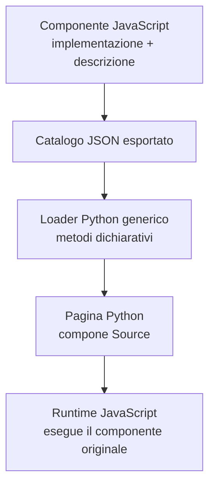

<a id="gc-055-050"></a>

## 050 · AST, build e CI: dove nasce il catalogo

Sourcerer usa Tree-sitter con la grammatica JavaScript da Python. Questo rende
concreta una seconda strada: leggere descrizioni statiche dai sorgenti senza
eseguire JS. In questo lavoro Tree-sitter ha già estratto l’inventario sintattico
delle classi; **non è ancora stata verificata l’estrazione completa dei metadati
ereditati dei componenti**.

L’analisi AST e la chiamata JS a `describe()` sono due alternative da confrontare:
la prima richiede un formato staticamente leggibile; la seconda usa la semantica
JS ma deve poter importare e descrivere le classi senza costruire un DOM.
Non è necessario introdurre un endpoint HTTP per descrivere una classe.

Il catalogo può essere generato durante il build locale o nella CI. La generazione
scrive nella copia di lavoro e in `build/`, non crea da sola commit o push. Il
pacchetto finale dovrebbe includere JSON e risorse JS corrispondenti, così il server
Python può usare il catalogo già pronto senza richiedere Node.

| Nel repository | Nel build | Nel pacchetto |
| --- | --- | --- |
| Sorgenti JS, descrizioni, estrattore, test | Catalogo generato e verifiche di coerenza | JSON, implementazioni JS e risorse allineate |

Rimangono da definire schema, versioni compatibili, collisioni, eredità dei metadati
e distribuzione degli artefatti. Eventuali stub Python per l’IDE devono essere
derivati dalla stessa fonte, non diventare un secondo catalogo manuale.

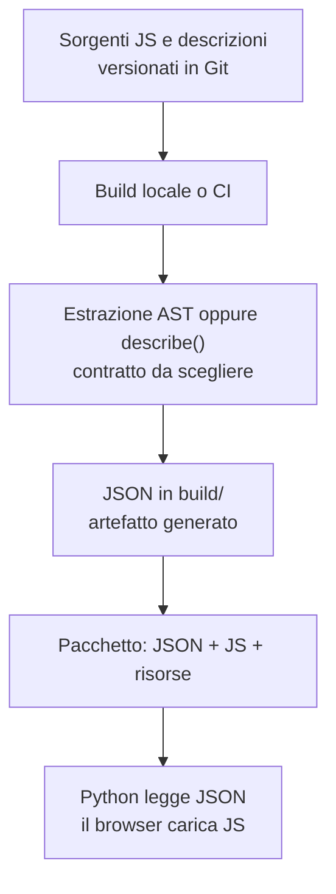

<a id="gc-055-055"></a>

## 055 · Collezioni ed estensioni di terzi

Una collezione è un’unità di organizzazione, registrazione e distribuzione.
Non è una superclasse: componenti di collezioni differenti possono usare la stessa
base, e una collezione può contenere più famiglie di componenti.

Il catalogo attuale contiene 10 collezioni e 38 descrizioni. Nel corpo della guida
le raggruppiamo per orientamento; l’appendice conserva i nomi dichiarativi esatti.

| Gruppo | Collezioni attuali |
| --- | --- |
| Campi e form | `inputs`, `colorpicker`, `forms` |
| Struttura e navigazione | `layout`, `palette`, `storeTree` |
| Dati visuali e strumenti | `grid`, `chart`, `clipboard`, `labEditors` |

Una collezione esterna dovrebbe dichiarare identità e versione, classi esportate,
compatibilità, dipendenze, entry point JS e risorse. Il suo JSON va consegnato
insieme all’implementazione corrispondente. Il consumatore sceglie esplicitamente
quali collezioni attivare; aggiungerne una non dovrebbe richiedere modifiche al
catalogo centrale del framework.

L’esperimento usa identità come `@acme/fields` e rifiuta i conflitti. Il namespace
della collezione non basta: i nomi Python selezionati e i tag DOM devono restare
univoci oppure seguire regole esplicite di alias. Il registro JS attuale è globale;
la convivenza di versioni differenti sulla stessa pagina non è stata dimostrata.
Anche dipendenze cicliche, caricamento lazy e aggiornamenti richiedono ulteriori test.

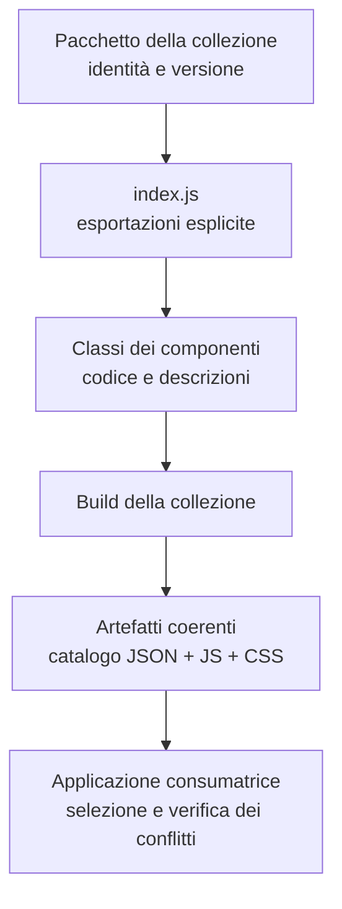

<a id="gc-055-060"></a>

## 060 · Server e database: due scelte indipendenti

Il core definisce responsabilità comuni; le implementazioni degli host vivono
negli adapter. FastAPI, Django o un altro server non devono diventare dipendenze
obbligatorie del core. Allo stesso modo, una scelta di server non determina il
sistema di accesso ai dati.

Per i database le responsabilità concordate sono `common`, `fake`, `genropy` e
`sqlalchemy`. `fake` permette di verificare i contratti senza un database reale;
SQLite è un backend utilizzabile tramite SQLAlchemy, non una quinta categoria.
Le capacità specifiche di GenroPy restano riconoscibili come tali.

Nel PoC ci sono già classi come `ModelProvider`, `ReadAdapter`, `BaseStore`,
`CollectionStore`, `RecordStore` e un adapter fake. La loro esistenza è evidenza
da revisionare. Non approva automaticamente i contratti generali di `dataRecord`,
`dataSelection` o di un protocollo universale di capacità.

Anche il termine “store” va precisato: store di una form, raccolte client e store
del database non sono necessariamente la stessa astrazione.

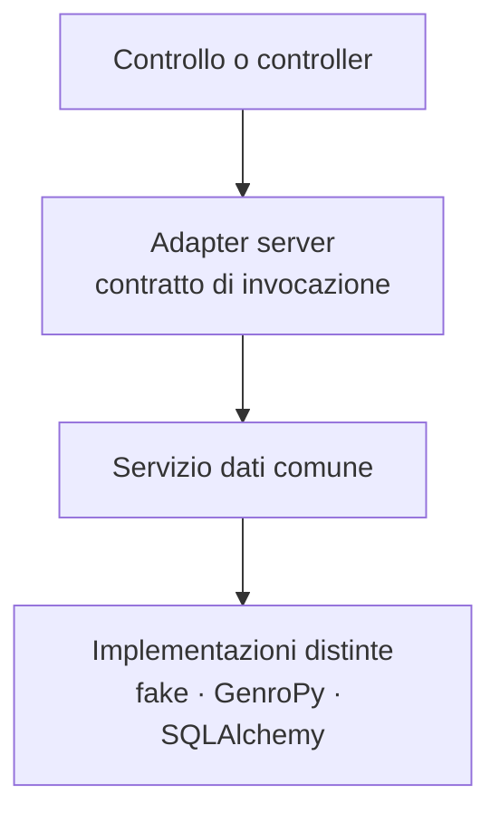

<a id="gc-055-065"></a>

## 065 · Che cosa impariamo dall’inventario GenroPy

L’inventario legacy è un indice di funzionalità da esaminare. Comprende 390 schede
ricavate da due alberi Python di dichiarazione, non un audit completo di tutte le
implementazioni JS GenroPy. Il censimento originale riporta 437 dichiarazioni
dirette e 310 registrazioni, consolidate nelle schede; le corrispondenze di nome
con Gramlot non garantiscono parità di parametri o comportamento.

| Famiglia da studiare | Esempi legacy | Domanda per il consolidamento |
| --- | --- | --- |
| Campi e selettori | `textBox`, `dbSelect`, `multiSelect` | Quale valore pubblico, quali binding, quale adapter? |
| Layout e composizioni | `formbuilder`, `grouplet`, `palettePane` | Componente autonomo o recipe che espande Source? |
| Griglie | `includedview`, `gridView`, `checkboxcolumn` | Quale responsabilità del controllo, delle celle e dello store? |
| Provider e store | `dataRecord`, `selectionStore`, `virtualSelectionStore` | Quale contratto comune e quali capacità backend-specifiche? |
| Azioni e popup | `menu`, `tooltip`, `dropDownButton` | Quale ownership di focus, comandi, apertura e cleanup? |
| Editor e media | `bagEditor`, `codemirror`, `fileUploader` | Quali dipendenze e quali collezioni opzionali? |

Le categorie sono un punto di partenza: una scheda sintattica classificata come
“component” può descrivere in realtà un helper di composizione. Prima di disegnare
una base occorre studiare il comportamento e confrontare almeno i consumatori
che dovrebbero condividerla. L’obiettivo è conservare i comportamenti utili senza
riprodurre automaticamente vincoli o meccanismi di Dojo.

<a id="gc-055-070"></a>

## 070 · Come può evolvere la gerarchia

**Proposta, non API disponibile.** Una direzione ragionevole è partire da poche
basi con responsabilità stabili e comporre le capacità trasversali. Per i campi
potrebbe essere utile distinguere un singolo controllo nativo da un campo composto
che coordina più controlli ma espone un solo valore.

Basi per popup e menu, una capacità `Lockable`, una capacità `Actionable` e una base
per controller sono candidati da verificare. Non occorre introdurli tutti prima
del primo port, né creare classi vuote per completare un diagramma.

La descrizione condivisa dei componenti può essere un contratto comune senza
forzare componenti DOM, controller e servizi a ereditare da un’unica superclasse.
Prima di scegliere fra metadati statici, mixin descrittivi e `describe()` occorre
verificare come si compongono le descrizioni e come Python le riceve.

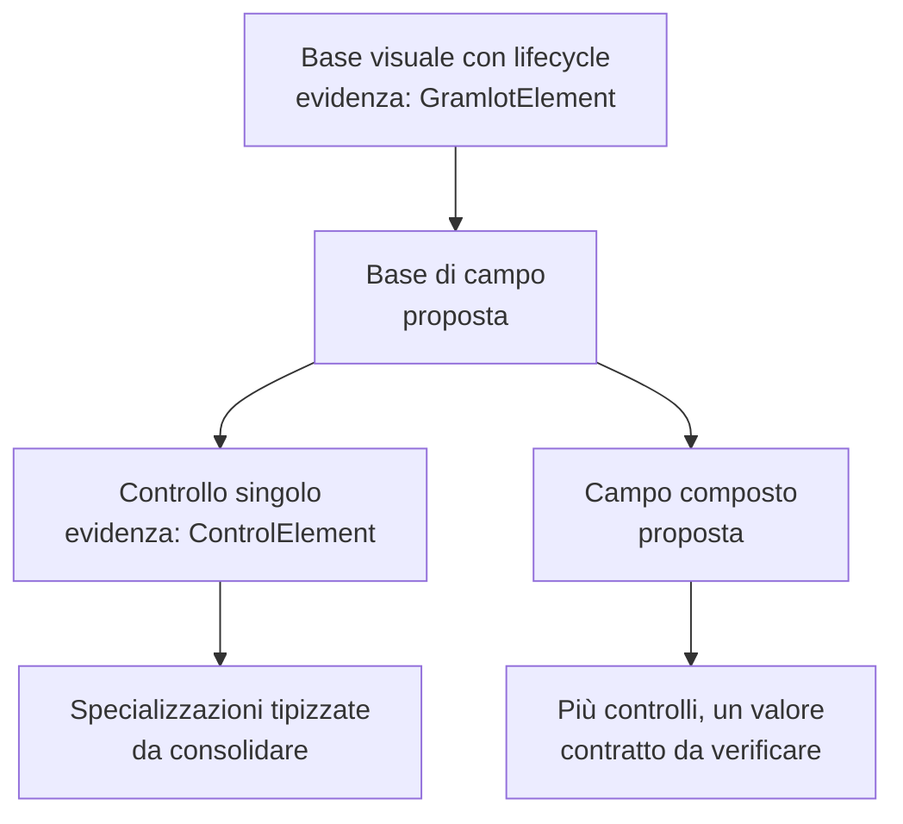

<a id="gc-055-075"></a>

## 075 · Come lavorare insieme sul consolidamento

Il contributo utile è un incremento piccolo e verificabile. Ogni port registra
la revisione di provenienza, il comportamento incluso, le responsabilità,
le dipendenze, i test, le differenze e gli elementi lasciati fuori. La revisione
nella destinazione decide l’accettazione di quel perimetro; un esperimento riuscito
nel PoC non trasferisce automaticamente l’intera architettura.

Prima di implementare una classe, il collaboratore deve poter rispondere a queste
domande:

1. Chi la costruisce e quali collaboratori riceve?
2. Quali Data può leggere o scrivere, e chi osserva quelle modifiche?
3. Quali risorse possiede e chi le rilascia?
4. Che cosa accade su disconnessione, riconnessione, errore e cancellazione?
5. Quali parti della sua descrizione arrivano a Python?
6. Quale test dimostra il comportamento, comprese le condizioni di errore?

Le applicazioni e i demo devono usare Source, Data Bag, binding, controller,
resolver e componenti condivisi. Quando manca una capacità, la si aggiunge al
livello riutilizzabile opportuno. I demo devono rendere disponibile il sorgente
e l’Inspector secondo il contratto comune.

Il riferimento consolidato è `main`; il lavoro nuovo passa dalla linea `develop`
e viene consolidato dopo verifica e accettazione. Pubblicare pacchetti o distribuire
applicazioni richiede un’autorizzazione separata.

<a id="gc-055-080"></a>

## 080 · Verifiche, coverage e decisioni ancora aperte

I test devono seguire il codice trasferito. La coverage JavaScript è essenziale:
è nel browser runtime che vivono rendering, binding e comportamento dei controlli.
La coverage Python misura un’altra parte: authoring, contratti e serializzazione.
Vanno presentate separatamente, includendo nella misura JS anche i file di prima
parte non importati dai test ed escludendo dipendenze, bundle generati e helper di test.

Node/jsdom è utile per i contratti ma non sostituisce verifiche in browser reale,
accessibilità e qualità visuale. La presenza di una classe nell’inventario non è
un test del suo comportamento.

| Decisione aperta | Prova necessaria |
| --- | --- |
| Descrizione delle classi e dei mixin | Base, specializzazione, mixin e override con risultato prevedibile. |
| Estrazione AST o esecuzione di `describe()` | Stesse descrizioni ottenute correttamente, senza istanziare controlli. |
| Selezione e versioni delle collezioni | Errori chiari per conflitti, dipendenze mancanti e versioni incompatibili. |
| Basi di componenti e controller | Lifecycle, isolamento, cleanup e scritture Data verificati. |
| Contratti server/database | Implementazione fake e almeno una integrazione reale sullo stesso contratto. |
| Artefatti per Python | Catalogo disponibile nel pacchetto senza Node sul server. |

Il primo traguardo resta una sequenza completa e piccola: dichiarazione Python,
trasporto, controllo, binding e controller JS, con evidenze leggibili da chi dovrà
estenderla.

<a id="gc-055-085"></a>

## 085 · Fonti e perimetro del documento

Riferimento del censimento:
`gramlot-org/gramlot-poc@10478b57ce3f22e6445eb6b72eba343520cbebac`.

- 113 file JS/ES-module analizzati con Tree-sitter.
- 112 costrutti di classe e 2 mixin funzionali; alcuni sono locali, anonimi o strumenti.
- 138 dichiarazioni di funzione a livello di modulo: il conteggio non include tutte le arrow function esportate.
- 38 descrizioni di componenti in 10 collezioni.
- 390 schede legacy e 6 schede curate di contratti correnti.

Le classi delle dipendenze, la generazione dinamica e gli altri repository Gramlot
non sono stati censiti come codice del PoC. L’esperimento JSON è locale nel ramo
`codex/js-component-manifest`, worktree `/private/tmp/gramlot-js-component-manifest`;
non è contenuto nella revisione baseline citata.

Le fonti e gli inventari sono riportati nelle appendici. L’HTML include diagrammi
SVG, stili e risorse necessari alla lettura offline. Solo i collegamenti alle fonti
esterne richiedono una connessione. Il documento è interno e non entra nel sito
pubblico Sphinx.

<a id="gc-055-090"></a>

## 090 · Appendici consultabili

Le appendici HTML riportano collezioni, classi e schede legacy con collegamenti alla revisione esaminata.

<!-- INVENTORY_APPENDICES -->
