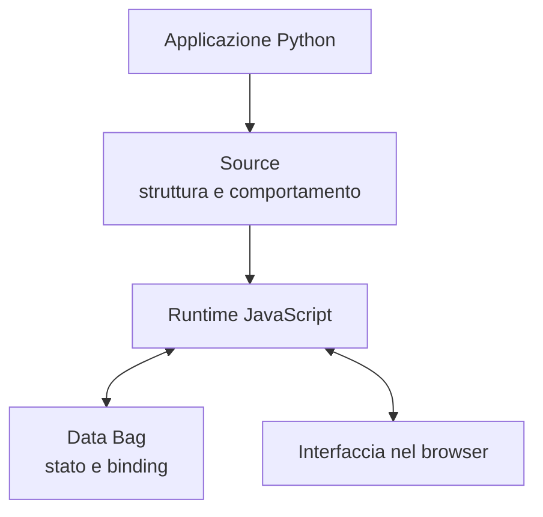
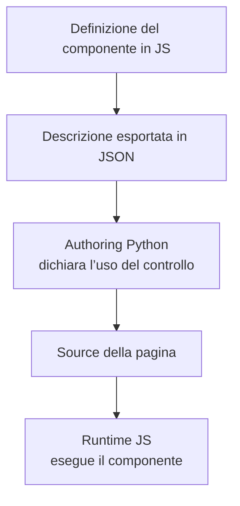
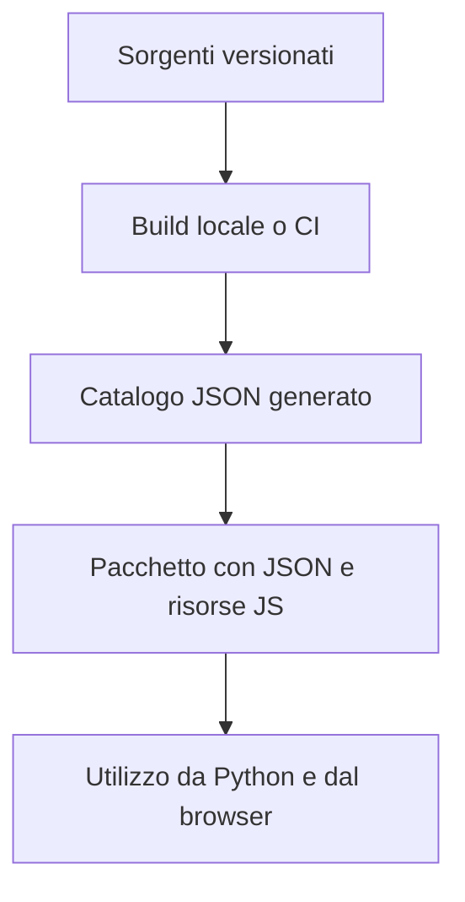

# Gramlot: l’architettura condivisa

**Edizione storica del 18 settembre 2026.** Il core attuale implementa il perimetro limitato HTML nativo e Source live; PoC, binding e ricette restano evidenza o lavoro futuro. Per lo stato corrente vedere [GC-070](070-work-status.md) e per la release [GC-110](110-native-html-readiness.md#gc-110-020).

**GC-060 · Guida essenziale per collaborare · 18 settembre 2026**

Questo documento raccoglie i principi concordati e la direzione di lavoro condivisa.
I diagrammi descrivono responsabilità e flussi, non una gerarchia definitiva di classi.

## 005 · Un framework, una destinazione

Gramlot è un framework indipendente per interfacce applicative dichiarative.
Il repository `gramlot` è la destinazione della versione definitiva e consolidata;
per il momento l’implementazione si trova in `gramlot-poc`.

Portare il codice in Gramlot significa consolidare insieme comportamento,
responsabilità, test e documentazione. Il lavoro procede attraverso incrementi
circoscritti e revisionati. Il riferimento consolidato è `main`; `develop`
accoglie il lavoro prima della verifica e dell’accettazione.

## 010 · Python descrive l’applicazione, JavaScript la fa funzionare

Python è il linguaggio principale per scrivere applicazioni. Il runtime JavaScript
realizza nel browser il comportamento dichiarato. Le due parti condividono un
contratto: Python non deve reimplementare ogni controllo del browser.

- **Source** descrive la struttura dell’interfaccia e il comportamento richiesto.
- **Data Bag** contiene lo stato applicativo.
- **Binding** collega le dichiarazioni ai dati.
- **Controller** reagisce a cambiamenti ed eventi.
- **Resolver** procura dati attraverso un contratto esplicito.
- **Componente** espone un controllo con parametri, valori, eventi e ciclo di vita.

Non tutti i nodi Source producono DOM: anche una dichiarazione di comportamento
può appartenere a Source. Le applicazioni usano questi meccanismi; non costruiscono
una gestione parallela di DOM, eventi, richieste o stato. Quando manca una capacità,
la si realizza nel livello riutilizzabile del framework.

## 015 · Il componente si definisce in JavaScript

La direzione condivisa è mantenere in JS la definizione del componente e la sua
descrizione pubblica. Python riceve descrizioni JSON e le usa per esporre i controlli
nell’authoring delle pagine. La stessa funzionalità non richiede quindi un wrapper
Python scritto a mano per ogni controllo.

Il catalogo descrive il contratto dichiarativo; l’implementazione eseguibile resta
JavaScript. Il JSON e il codice JS corrispondente devono accompagnarsi nella
distribuzione. Chi scrive l’applicazione continua a comporre la pagina in Python.

## 020 · Il catalogo è un artefatto di build

Le descrizioni derivano dai sorgenti, senza diventare un secondo catalogo da
aggiornare manualmente. La generazione può avvenire nel build locale o nella CI.
Gli artefatti generati vengono inclusi nel pacchetto destinato ai consumatori.

Generare il JSON in CI non modifica automaticamente la storia Git: non implica
commit o push. Python deve poter leggere il catalogo distribuito senza richiedere
l’esecuzione di JavaScript sul server.

## 025 · Riuso: basi, mixin e funzioni comuni

Le responsabilità sono distinte:

| Strumento | Compito |
| --- | --- |
| Classe base | Stabilisce il contratto e il comportamento comune di una famiglia. |
| Mixin | Aggiunge una capacità riutilizzabile a una classe. |
| Collaboratore o servizio | Fornisce comportamento attraverso un contratto e, quando necessario, gestisce stato o risorse. |
| Funzione comune | Offre codice di libreria riutilizzabile dalle varie classi. |
| Recipe | Compone normali nodi Source. |

Ogni oggetto deve rendere esplicite le proprie dipendenze, la proprietà delle
scritture nei Data e la gestione del ciclo di vita. Chi acquisisce listener,
sottoscrizioni, timer o richieste deve avere una responsabilità chiara per il cleanup.
Errori, conflitti fra capacità e isolamento fra istanze fanno parte del contratto.

La composizione Python per l’authoring, quella JS nel browser e quella lato server
sono meccanismi distinti. Il riuso non richiede di replicare le stesse classi nei due
linguaggi: le controparti Python servono dove esiste una superficie dichiarativa
o un contratto effettivamente condiviso.

## 030 · Collezioni e contributi esterni

Le collezioni organizzano gli oggetti JS esposti e costituiscono il punto di ingresso
per estendere il framework anche con contributi di terzi. La loro organizzazione
va distinta dalla gerarchia delle classi: una collezione non è una superclasse.

Il percorso di estensione deve mantenere la definizione in JS, rendere disponibile
la descrizione a Python e usare i contratti condivisi del framework. Componenti,
controller e codice comune conservano le rispettive responsabilità anche quando
provengono da una collezione esterna.

## 035 · Server e database restano indipendenti

Il core non dipende da uno specifico server o database. Gramlot definisce i contratti
comuni; le integrazioni implementano le parti proprie dell’host o del backend.
Scegliere un server non deve imporre la scelta del database.

Per i database distinguiamo:

- **common**: contratti e comportamento condiviso;
- **fake**: verifiche controllate senza un database reale;
- **genropy**: implementazione e capacità specifiche GenroPy;
- **sqlalchemy**: implementazione attraverso SQLAlchemy.

SQLite è un backend utilizzabile tramite SQLAlchemy. Le estensioni specifiche di
un’implementazione mantengono il proprio confine; non diventano automaticamente
requisiti universali.

## 040 · Come si consolida un contributo

Un incremento entra nel core quando contratto, codice, test e documentazione
concordano sul comportamento incluso. Le differenze rispetto al PoC e al legacy
si registrano, insieme ai limiti e al feedback della revisione.

La verifica deve misurare il comportamento nel livello che lo realizza. Per Gramlot
la coverage del runtime JavaScript è centrale e va distinta da quella dell’authoring
Python. Un risultato del PoC resta riferito al codice e alla revisione misurati;
test e verifiche accompagnano il trasferimento nel core.

Chi collabora parte quindi da un perimetro chiaro: responsabilità, dati letti e
scritti, risorse possedute, errori e test di accettazione. La documentazione pubblica
racconta ciò che è disponibile per gli sviluppatori; i documenti architetturali
restano materiale interno di lavoro. La pubblicazione di pacchetti o applicazioni
è un’azione distinta dal consolidamento del sorgente.
