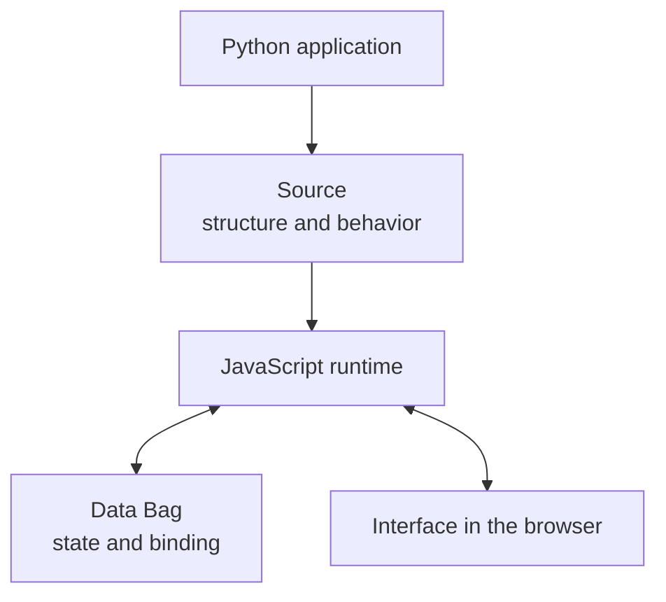
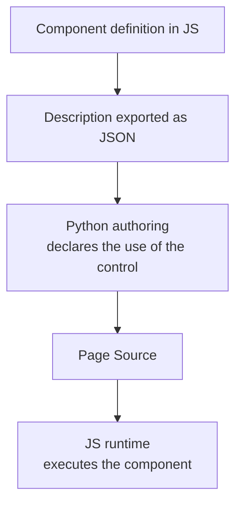
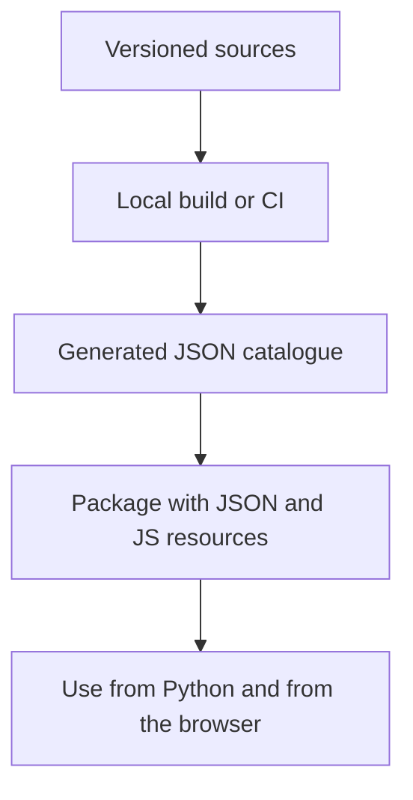

# Gramlot: the shared architecture

**Historical edition of 18 September 2026.** The current core implements the bounded native HTML and live Source scope; PoC, bindings and recipes remain evidence or future work. For the current status see [GC-070](070-work-status.md) and for the release [GC-110](110-native-html-readiness.md#gc-110-020).

**GC-060 · Essential guide for collaborating · 18 September 2026**

**Release 0.2.0:** the current code is **0.1.2**. Section 045 describes the architecture of the 0.2.0 HTML/SVG binding. **The 0.2.0 parts are planned and not implemented.**

This document collects the agreed principles and the shared direction of work.
The diagrams describe responsibilities and flows, not a final class hierarchy.

## 005 · One framework, one destination

Gramlot is an independent framework for declarative application interfaces.
The `gramlot` repository is the destination of the final, consolidated version;
for the moment the implementation is in `gramlot-poc`.

Porting code into Gramlot means consolidating behavior, responsibilities, tests
and documentation together. Work proceeds through bounded, reviewed increments.
The consolidated reference is `main`; `develop` receives work before verification
and acceptance.

## 010 · Python describes the application, JavaScript makes it work

Python is the main language for writing applications. The JavaScript runtime
realizes the declared behavior in the browser. The two parts share a contract:
Python must not reimplement every browser control.

- **Source** describes the interface structure and the required behavior.
- **Data Bag** contains the application state.
- **Binding** connects declarations to data.
- **Controller** reacts to changes and events.
- **Resolver** obtains data through an explicit contract.
- **Component** exposes a control with parameters, values, events and lifecycle.

Not all Source nodes produce DOM: a behavior declaration can also belong to
Source. Applications use these mechanisms; they do not build a parallel handling
of DOM, events, requests or state. When a capability is missing, it is built in
the reusable layer of the framework.

## 015 · The component is defined in JavaScript

The shared direction is to keep the component definition and its public
description in JS. Python receives JSON descriptions and uses them to expose the
controls in page authoring. The same functionality therefore does not require a
hand-written Python wrapper for each control.

The catalogue describes the declarative contract; the executable implementation
remains JavaScript. The JSON and the corresponding JS code must travel together in
distribution. Whoever writes the application keeps composing the page in Python.

## 020 · The catalogue is a build artifact

The descriptions derive from the sources, without becoming a second catalogue to
update by hand. Generation can happen in the local build or in CI. The generated
artifacts are included in the package intended for consumers.

Generating the JSON in CI does not automatically change the Git history: it does
not imply commit or push. Python must be able to read the distributed catalogue
without requiring JavaScript execution on the server.

## 025 · Reuse: bases, mixins and common functions

The responsibilities are distinct:

| Tool | Task |
| --- | --- |
| Base class | Establishes the contract and the common behavior of a family. |
| Mixin | Adds a reusable capability to a class. |
| Collaborator or service | Provides behavior through a contract and, when needed, manages state or resources. |
| Common function | Offers library code reusable by the various classes. |
| Recipe | Composes ordinary Source nodes. |

Every object must make explicit its dependencies, the ownership of its Data
writes and its lifecycle handling. Whoever acquires listeners, subscriptions,
timers or requests must have a clear responsibility for cleanup. Errors,
conflicts between capabilities and isolation between instances are part of the contract.

Python composition for authoring, JS composition in the browser and server-side
composition are distinct mechanisms. Reuse does not require replicating the same
classes in both languages: Python counterparts serve where a declarative surface
or an actually shared contract exists.

## 030 · Collections and external contributions

Collections organize the exposed JS objects and are the entry point for extending
the framework, also with third-party contributions. Their organization must be
kept distinct from the class hierarchy: a collection is not a superclass.

The extension path must keep the definition in JS, make the description available
to Python and use the shared framework contracts. Components, controllers and
common code keep their respective responsibilities also when they come from an
external collection.

## 035 · Server and database remain independent

The core does not depend on a specific server or database. Gramlot defines the
common contracts; integrations implement the parts specific to the host or the
backend. Choosing a server must not impose the choice of database.

For databases we distinguish:

- **common**: contracts and shared behavior;
- **fake**: controlled checks without a real database;
- **genropy**: GenroPy-specific implementation and capabilities;
- **sqlalchemy**: implementation through SQLAlchemy.

SQLite is a backend usable through SQLAlchemy. The specific extensions of an
implementation keep their own boundary; they do not automatically become
universal requirements.

## 040 · How a contribution is consolidated

An increment enters the core when contract, code, tests and documentation agree
on the included behavior. Differences from the PoC and from legacy are recorded,
together with the limits and the review feedback.

Verification must measure behavior in the layer that realizes it. For Gramlot
the coverage of the JavaScript runtime is central and must be kept distinct from
that of Python authoring. A PoC result stays tied to the measured code and
revision; tests and checks accompany the transfer into the core.

A collaborator therefore starts from a clear scope: responsibilities, data read
and written, resources owned, errors and acceptance tests. The public
documentation tells what is available to developers; the architectural documents
remain internal working material. Publishing packages or applications is an
action distinct from consolidating the source.

## 045 · HTML/SVG binding in 0.2.0: planned architecture

**Status: planned, not implemented. The current code is 0.1.2.** Source: the
0.2.0 binding plan confirmed by the owner on 2026-09-25. Phase S00 records it
as GC-210 and as a constitution amendment. The technical detail, in English, is
in [GC-045 §055](045-js-taxonomy.md#gc-045-055), [§060](045-js-taxonomy.md#gc-045-060),
[GC-087 §085](087-javascript-layer-boundaries.md#gc-087-085) and
[GC-065 §030](065-host-adapters.md#gc-065-030).

In 0.1.2 declarations remain inert and no binding exists. 0.2.0 adds:

- **Data:** an outer root contains `main`, which is the document Bag
  (`builder.data`). Gramlot has a single Data subscription and a single router
  (`DataRouter`). Paths written by the author do not contain `main`.
- **Separate lifetimes:** `NodeBinding` owns the semantic lifetime of a Source node
  (registrations, providers, timers). The renderer record owns the DOM lifetime
  (element, listeners). No subclass of `SourceBagNode`.
- **Branch installation in 8 steps:** validation, `dataSetter`, defaults,
  registration, `_init`, DOM, `_onBuilt`, `_onStart`. The `dataSetter` nodes are
  installed before the DOM is built.
- **Source events in a FIFO:** semantic work always happens, also under freeze.
  Structural DOM work happens only outside frozen branches.
- **Named logic** (`func`) as the primary path: logic groups per resource
  (`LogicRegistry`, `LogicGroup`). Inline code compiles only in the page runtime,
  never in the Host or the WorkerHost.
- **Data writes** with the Builder Source node methods (`SET`, `PUT`, `FIRE`,
  `FIRE_AFTER`). Gramlot does not add its own set of operations.
- **Page resources:** `css_requires` and `js_requires` replace `Page.css`;
  `PageBootstrap` loads the resources and registers the logic before startup.
- **Dependencies:** the fixes U1-U4 in genro-builders and genro-bag are required.
  They do not exist today; Gramlot does not replace them with local code.
