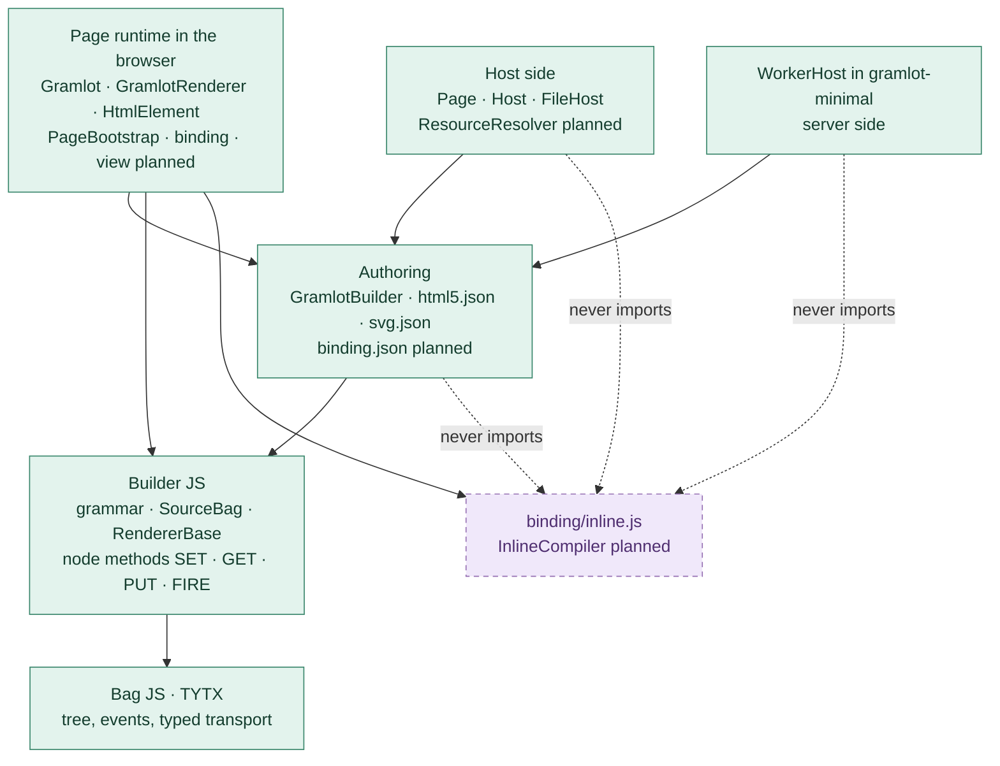

# 087 · JavaScript layer boundaries


> **Current 0.1.2 ownership:** Gramlot uses generic Builder JS for grammar, SourceBag, `sourceTarget` and static rendering; `GramlotRenderer` extends generic `RendererBase` and owns live DOM behavior. DOM JS is removed from the active dependency path. Sections 005–030 preserve earlier, superseded decisions.
>
> Current execution: [GC-110](110-native-html-readiness.md#gc-110-020); status: [GC-070](070-work-status.md).
> This document retains earlier decisions and checkpoints. Statements about pending
> extraction or completed verification refer to their recorded stage, not current
> architectural acceptance. GC-087's later dated decisions are evidence; GC-110 controls current release work.

Document ID: **GC-087**. Decision date: **2026-09-19**. Status: **historical ownership sequence; current 0.1.2 boundary stated above**.

**Release scope:** the current code is release **0.1.2**. Section 085 adds the layer boundaries of the 0.2.0 HTML/SVG binding plan. **The 0.2.0 parts are planned and not implemented.**

[Concise counterpart](../../docs_llm/internal/087-javascript-layer-boundaries.md).

<a id="gc-087-005"></a>

## 005 · Historical logical ownership — superseded for 0.1.0

This 2026-09-19 decision superseded earlier alternatives at that time. Later owner decisions retired the active DOM JS layer and deferred recipes. The historical model below is preserved for traceability; it is not the 0.1.0 dependency graph. The earlier decision described where the JavaScript builder
and renderers belong. The intended dependency direction is:

```text
Gramlot ──uses──→ DOM JS ──uses──→ Builder JS ──uses──→ Bag JS / TYTX
                                     ↑
                                     │ uses
                         future SQL dialect + SQL renderer
```

Bag JS and TYTX own tree structure, events and registered typed transport.

Generic Builder JS owns declaration grammar and authoring, `SourceBag`, builder
association, recipes and only a renderer base that is independent of browsers,
HTML and DOM APIs. `RendererBase` defines generic traversal and dialect dispatch;
it does not create, update or remove DOM nodes and does not select an HTML output.

Each dialect owns its concrete renderer. The HTML dialect uses DOM JS, whose
renderer owns HTML/DOM realization, updates and cleanup. A future SQL dialect can
depend directly on generic Builder JS and supply its own SQL renderer without
depending on DOM JS or Gramlot.

Gramlot depends on the HTML/DOM layer and adds application-level pages,
components, Data bindings, controllers and host coordination. It may specialize
the HTML renderer for application behavior, but DOM mechanics belong to DOM JS.

<a id="gc-087-010"></a>

## 010 · Historical pre-extraction baseline

Before GC-088 execution, the repository layout had not been migrated to these boundaries. Gramlot then
declared `genro-dom-js` as a dependency. Its `GramlotBuilder` extends `HtmlBuilder`
from that package and `GramlotRenderer` extends its `RendererBase`; the concrete
renderer remains in Gramlot core. That dependency combined generic
builder/recipe responsibilities with HTML/DOM behavior.

In particular, the pre-extraction `RendererBase.finalize` created a
`DocumentFragment`. That is browser-specific behavior and must move behind the
HTML/DOM dialect renderer before the base can satisfy the agreed generic boundary.
This document records the gap; it does not implement that move.

The names and repository homes for generic Builder JS and DOM JS are not settled
by this decision. No new repository, rename, extraction, dependency removal or
source movement is implied. GC-086 remains the map of files and dependencies that
actually exist today.

<a id="gc-087-015"></a>

## 015 · History and superseded interpretations

The 2026-09-09 retirement notice moved JavaScript builder/renderer development
from `genro-dom-js` into the framework then named Gramlot, now `gramlot-poc`, and
kept the old repository for recovery. Reintroducing `genro-dom-js` as a dependency
during the current integration was an implementation mistake under that decision,
not approval of the old package boundary.

A later interpretation placed generic and specialized JavaScript layers together
inside the destination Gramlot repository. The owner subsequently chose separated
logical layers and clarified that generic Builder JS owns only `RendererBase`,
while each dialect owns its concrete renderer. That latest clarification is the
current decision.

Preserving this history does not decide whether an existing repository will be
reactivated, renamed or replaced. Those are explicit follow-up ownership and
migration decisions.

<a id="gc-087-020"></a>

## 020 · Historical extraction follow-up — superseded

- Define the generic Builder JS package/repository name and ownership.
- Define the DOM JS package/repository name and ownership.
- Specify and test a DOM-neutral `RendererBase`, including replacement of the
  current DOM-specific `finalize` behavior by dialect-level finalization.
- Move HTML/DOM creation, update and cleanup to the DOM JS concrete renderer while
  preserving current Source events, reference lifecycle and atomic updates.
- Rebase Gramlot on the resulting DOM JS API and remove the mixed dependency only
  after equivalent package-boundary and browser verification passes.
- Define the missing JavaScript grammar declaration surface, including whether it
  needs semantic parity with Python decorators, before claiming authoring parity.

Until that work is implemented and verified, documentation must distinguish the
agreed ownership model from the current package graph and file locations.


<a id="gc-087-025"></a>

## 025 · Local execution of the agreed split

Owner instruction to complete GC-088 authorizes the bounded local extraction.
The generic implementation is now in a separate local `genro-builders-js` package;
`genro-dom-js` owns `DomRendererBase`, `HtmlSourceRenderer` and `HtmlElement`.
Gramlot specializes the renderer with its reference collaborator and metadata.
This supersedes the old retirement restriction for this bounded development work;
it does not rename/create a remote repository or authorize publication.

SOURCE remains the single currently integrated Python/JS wire suffix. Plain ESM
declaration helpers avoid a mandatory decorator transform. Historical internal DOM
module paths re-export generic classes rather than registering a second SourceBag.
Full upstream availability, clean floating installs and acceptance remain open.


<a id="gc-087-030"></a>

## 030 · Owner clarification: Python-equivalent generic builder

Owner, 2026-09-20: Builder JS should be the port of the current Python builder,
with declarative grammar loaded from JSON instead of relying on Python decorators.
It is a generic grammar/Source/rendering system, not an HTML-first framework.
Database definitions, electronic invoices and other vocabularies are legitimate
possible dialects. They may supply static JSON, XML or other renderings. These
examples clarify extensibility; they do not add database/invoice implementation
to the current native-HTML milestone.

The grammar describes valid declarations; Source is the authored document;
the selected renderer produces the representation. An HTML grammar supports HTML
documents or fragments. Gramlot can use an object-producing renderer with its
reactive realization/lifecycle. Returning objects alone does not imply reactivity:
Python already supports both string and object renderers.

Preserve Python's distinction between renderer selection, materialization and
final delivery. Generic Builder JS must not require DOM, an Application instance
or an application reactive engine to author/render a non-HTML dialect. Audit against
the current Python implementation, not its removed partial-update engine. Concrete
dialect renderers remain distinct from RendererBase; no package relocation or
retirement of the existing DOM Application API is implied by this clarification.

JSON carries declarative descriptions, not executable method bodies. The handling
of body-bearing container/component methods must be checked against the Python
contract rather than silently omitted or encoded as new executable wire content.
No implementation changed in this clarification.

Owner follow-up, 2026-09-20: static HTML rendering produces HTML text. A concrete
possible use is Gramlot's initial bootstrap: the Host authors an HTML Source
(head, CSS links, root element and initialization script), the static renderer
produces the response text, and the host adapter delivers it. After loading,
the browser runtime requests main and renders its Source into live DOM objects.
These are separate rendering operations. Bootstrap generation through the static
renderer is a proposed application of the agreed contract, not an implemented
feature: the current Python and JS Hosts still assemble HTML strings directly.

<a id="gc-087-035"></a>

## 035 · Reactive ownership belongs to Gramlot

Owner, 2026-09-20: reactive code leaves Builder JS and belongs to Gramlot. DOM JS
may disappear, but its deletion is not decided. This supersedes the earlier §005
assignment of live Source updates and lifecycle coordination to DOM JS, and
answers the generic-base removal question in GC-094 §105. No compatibility engine
is to be retained in the generic builder to support the old DOM Application.

Builder JS owns declarative Source, grammar, static Data/value resolution, recipes,
and generic rendering. Static object output remains possible; producing an object
alone is not reactivity. Gramlot owns Source subscriptions, live records, update
coordination and cleanup. Bag continues to own its generic events/backreferences.

The current native-HTML HtmlSourceRenderer and Source-mutation projection move from
DOM JS into Gramlot. The old Application's row/cell patch runtime is not silently
promoted into the native-HTML milestone. Remaining DOM HTML/SVG rendering, element
operations, CSS helpers and collections must be inventoried before deciding whether
the package should survive or where those responsibilities should go.

<a id="gc-087-040"></a>

## 040 · Included HTML5 dialect and Gramlot capabilities

Owner, 2026-09-20: Builder JS must include the HTML5 grammar, HtmlBuilder and
static HTML text renderer, as a bundled dialect of the generic builder. Gramlot
adds labels, reactive bindings and style-attribute transformation. For example,
`style="background-color: red"` is a native HTML attribute; interpreting
`background_color="red"` and composing CSS belongs to Gramlot. These capabilities
remain later work, not additions to the current pure-HTML implementation slice.

The owner also approved relocating HtmlElement and DomRendererBase into Gramlot
and removing its DOM JS dependency, while retaining that repository as reference.
These transfers and the included static HTML dialect remain pending implementation.
This refines §035; it does not authorize deleting the DOM JS repository.

Reference discrepancy found by source inspection: the current Python
`genro_builders/contrib/html/html_renderer.py` already implements CSS roots,
`style_*` conversion and Genro CSS macros through `adapt_attrs` / `_adapt_style`.
Thus the newly agreed JS boundary intentionally excludes some existing Python
HTML renderer behavior. Do not port these conveniences into Builder JS merely
for parity. Whether to change the Python reference is a separate open decision;
no Python runtime code was changed. Native `style` serialization remains supported.

<a id="gc-087-045"></a>

## 045 · HTML dialect owns CSS transformation

Owner confirmation, 2026-09-20: keep CSS attribute transformations and macros in
the bundled HTML5 renderer of Builder JS, consistently with Python HtmlRenderer.
For example, `background_color="red"` becomes `style="background-color: red"`
in static HTML. This supersedes §040's exclusion of CSS transformation from that
dialect; generic RendererBase remains CSS-agnostic. Gramlot is to reuse the HTML
dialect transformation for dynamic DOM, not duplicate it. Labels, boxing, reactive
bindings and DOM lifecycle belong to Gramlot. This assigns future capability
ownership; it does not add labels/bindings to the current native HTML slice.
No Python CSS removal is requested. Static HTML port and DOM dependency removal
are in progress; verification and acceptance are separate.

<a id="gc-087-050"></a>

## 050 · Explicit CSS attributes override style

Owner, 2026-09-20: explicit CSS attributes beat the `style` string regardless of
attribute order. Both HTML renderers (Python and JS) now seed CSS from `style`
before applying explicit keywords, `style_*` escapes and existing macros. For
example, `width="100px"` plus `style="width: 1px; color: blue"` yields
`width: 100px; color: blue` in either order. Unrelated fallback properties survive.
This resolves the order-dependent reference defect recorded in GC-094 §115.
No new precedence between competing explicit keyword/macro forms is introduced.
No labels/binding or live DOM CSS integration is added.

<a id="gc-087-055"></a>

## 055 · Recipe tree, root attributes and labeled descendants

**Owner scope update, 2026-09-20 — recipes deferred:** keep only the possibility
of a Source macro/authoring shortcut. Do not define or implement its contract now.
The earlier root/override/parameter discussions below are retained as history,
not current acceptance criteria or prerequisites. Existing recipe code is
provisional; it is not being accepted, extended or removed by this deferral.
Continue the generic builder and ordinary native HTML authoring/static rendering.

Owner, 2026-09-20: a recipe produces one tree, with one outermost parent node.
Caller-supplied attributes apply to that root and override attributes supplied by
the recipe itself. A recipe reference therefore addresses the resulting root;
no separate group object or automatically inserted wrapper is required. This
supersedes the earlier proposal to prohibit references to recipe markers.

Caller parameters can also target named descendant Source nodes through label
prefixes, recursively to arbitrary depth. Example: `left_color="red"` addresses
`color` on the child labeled `left`; `left_icon_width="16px"` addresses `width`
on `icon` under `left`. Caller values override recipe defaults at every target.
This routing happens during Source expansion, before dialect rendering or CSS
attribute transformation. Internal labels are Source node labels.

Implementation is pending. Python's current renderer already requires one root
for component expansion and passes body kwargs to the body, but the inspected
expansion code does not automatically implement this label-prefix routing. The
current JS named RecipeExpander still allows a forest, drops marker attrs and
rejects __ref; these must change under this newly specified contract, not be
presented as existing behavior.

Owner naming guidance: using CSS attribute names as Source labels is strongly
discouraged. Prefer structural labels such as `left`, `header` and `content`, so
label-prefixed routing does not collide with root CSS attributes. This is a naming
recommendation, not authorization for a CSS-name blacklist or a new label validator.
Routing follows the known Source labels; no CSS-specific namespace is added to the
generic builder. The implementation must not silently invent behavior for
ambiguous structural label paths.

Owner clarification, 2026-09-20: a recipe is a Source macro, only a
preprocessor. Its result is the same tree the author could write manually using
the available builders and their ordinary composition rules. It may use whichever
builders its body needs. The renderer receives the expanded nodes; no recipe
runtime object, renderer or independent dialect-selection protocol is implied.
The earlier enclosing-builder-versus-recipe-builder question was too restrictive
and is withdrawn. Preserve the normal builder ownership of the authored nodes.


Owner clarification: recipe construction inputs must be distinguished from the
attributes applied to the first/root node. For example, `row_count=3` can control
construction while `color="red"` decorates the resulting root. The mechanism for
identifying those roles is not yet specified. The existing grammar 1.1 signature
descriptor preserves named parameters and defaults, but does not itself declare
this construction-versus-root distinction. Reusing recipe declarations to make
that distinction is a proposal, not implemented or accepted behavior.

<a id="gc-087-060"></a>

## 060 · Null text at the DOM boundary

Owner correction, 2026-09-20: null becomes an empty string when transferred to the
DOM node, not in Python or generic static serialization. Source/Data retain their
values. This supersedes the assistant's incorrect static-HTML interpretation of
this decision, which was implemented briefly and then reverted in both languages.

Gramlot's existing HtmlElement.text()/compose() and input value assignment already
perform the DOM conversion. A native Source regression verifies initial null text,
updates back to null, unchanged element identity, and empty input.value while
Source retains null. Zero/false are not converted to empty. No extra normalizer,
class, static-renderer change or new live-binding contract is introduced.

<a id="gc-087-065"></a>

## 065 · Compact CSS macro precedence

Owner, 2026-09-20: when a compact CSS macro conflicts with the expanded direct
property, prefer the compact form. In the discussed case, `rounded=4` wins over
`border_top_left_radius='20px'`, producing `4px` on that corner. This is independent
of argument order and already matches both Python and JS HTML renderers, which
apply macros after ordinary CSS properties. No runtime change is necessary.
The earlier explicit-attributes-over-style rule remains in force. This decision
does not define a general ranking for every possible pair of macro sub-parameters.

<a id="gc-087-070"></a>

## 070 · Native grammar JSON is the single declaration source

Owner, 2026-09-20: JSON declarations are portable between Python and JavaScript;
JavaScript declarations only serve JavaScript. Never duplicate a vocabulary.
HTML uses the existing complete exported HTML5 JSON. SVG follows the same rule;
its missing packaged export has now been generated through SvgBuilder.to_grammar.
This resolves the earlier question about removing all JS declaration APIs: that
blanket removal was not requested.

The sole native collection generation entry point is now genro-builders-js's
scripts/export_collections.py (npm run export:collections), using the existing
Python exporter for HtmlBuilder and SvgBuilder. Its src/collections files are the
canonical JSON artifacts: 117 HTML elements; 58 SVG elements and 2 abstracts.
Gramlot's scripts/export_collections.py copies both from the installed builder JS
package (or an explicitly supplied export directory) to src/gramlot/collections.
The JS runtime inherits the bundled HtmlBuilder grammar directly. The redundant
js/collections packaging copy was removed on 2026-09-21; tests read the shared
Python package export when they need the raw JSON.
Copies needed by separate distributions are generated artifacts, never editable
alternative vocabularies. Runtime consumers do not re-export or rewrite grammar.

Verified byte equality with fresh complete Python exports and across installed
JS/Python package resources; both loaders accept SVG and enforce circle's leaf
constraint. Python/Node/Bun static XML checks pass; HtmlBuilder static HTML is
unchanged. Export availability does not imply a registered JS SvgBuilder, a
dedicated SVG renderer or live SVG support in Gramlot. Those remain separate work.

<a id="gc-087-075"></a>

## 075 · SVG adaptation ownership

Owner authorized both static and live SVG after §070. genro-builders-js now owns
SvgBuilder (canonical JSON), SvgRenderer (static strings) and svgAttributes (one
attribute adapter shared with Gramlot). Python's SVG boundary metadata was fixed
at its source and re-exported: the envelope is SVG; HtmlRenderer adds XHTML to
immediate entered-HTML children, using subbuilder metadata without tag-name checks.

Gramlot reuses the single live HtmlSourceRenderer for native HTML/SVG builders via
RendererBase.addRender/getRender. HtmlElement handles native namespace creation,
namespace-aware attributes and native property reflection only on HTML elements.
Namespace/tag changes require replacement; ordinary SVG attribute changes preserve
the element. Boundary declarations are validated against the enclosing Bag's
builder, while descendants use the entered dialect. No dialect flattening.

Bag owns detached node creation before validation. SourceBag uses that extension
point to initialize runtime builder ownership before insertion events; no per-node
subclass or hidden declaration attributes. Rejected prebuilt-branch insertion
restores prior ownership. Remote Source uses the target builder through the same
decoding/expansion/preparation pipeline. This only preserves destination context;
it does not approve a new recipe contract.

Verified scope and remaining work are in GC-070 and GC-094 §155. This supersedes
§070's then-current absence of JS SvgBuilder/static rendering/live SVG support.

<a id="gc-087-080"></a>

## 080 · Remove the alternate JS declaration surface

Owner decision, 2026-09-20: remove the unneeded JS declaration surface from the
consolidated generic builder immediately. This supersedes the earlier preservation
of defineDeclarations and plain-ESM declaration helpers. Do not move the surface to
another production name or invent a registry to keep it alive. No PoC copy requested.

Grammar descriptions use builder_grammar 1.1 JSON. Existing class-level loading is
needed by HtmlBuilder/SvgBuilder; per-instance loading is needed by Gramlot's
collections. These are destinations for the same format, not alternate notations.
Executable methods remain code; removing grammar helpers does not remove existing
container/component execution or Python's own decorators/exporter. The deferred
recipe implementation and Source replace decision are unchanged.

<a id="gc-087-085"></a>

## 085 · Planned 0.2.0 binding layer boundaries

**Status: planned and not implemented. The current code is 0.1.2.** Source: the
owner-confirmed 0.2.0 binding plan of 2026-09-25 and owner decision D7 of the same
date. Phase S00 records them as GC-210 and a constitution amendment. Class details
are in [GC-045 §055](045-js-taxonomy.md#gc-045-055).

**Current 0.1.2 boundaries:**

- Bag JS and TYTX own the tree, events and typed transport.
- Builder JS owns grammar, `SourceBag`/`SourceBagNode`, `RendererBase`,
  `HtmlBuilder`/`SvgBuilder`, static rendering and `svgAttributes`.
- Gramlot owns `GramlotBuilder`, `GramlotRenderer`, `HtmlElement`, `Gramlot`,
  `MainTransport`, `References` and the host adapters.
- The browser entry `js/src/index.js` exports `Gramlot`, `GramlotBuilder`,
  `GramlotRenderer`, `Bag`, `BagNode`, `References` and `MainTransport`. The server
  entry `js/src/adapters/index.js` exports `Page`, `source`, `Host`, the host errors,
  `GramlotBuilder` and `FileHost`. The browser entry does not import the server entry.
- Declarations are inert: `compute_logic` (`src/gramlot/page/builder.py:52`) and
  `computeLogic` (`js/src/builder/gramlot-builder.js:17`) are empty. No binding exists.

**Planned 0.2.0 boundaries:**

- **Builder and Bag stay read-only for Gramlot** (constitution §14). Gramlot code
  writes Data with the Builder Source node methods. The upstream fixes U1-U4
  ([GC-045 §060](045-js-taxonomy.md#gc-045-060)) belong to genro-builders and
  genro-bag. Gramlot adds no local substitute.
- **Authoring** (Python and JS `GramlotBuilder`, `binding.json`): grammar only.
  `binding.json` redefines `dataSetter`, `dataFormula`, `dataController` and loads
  after `html5.json`. `compute_logic`/`computeLogic` stay empty. `GramlotBuilder` does
  not change for logic resolution.
- **Host side** (Python `Host`, JS `Host`/`FileHost`, `server/resources.py`,
  `adapters/resources.js`): resolves the page, resolves `js_requires`/`css_requires`
  names to ordered URLs and writes the bootstrap with a nonce. It never evaluates code
  strings. The standalone WorkerHost (gramlot-minimal) counts as server side: no eval there.
- **Page runtime** (browser: `bootstrap.js`, `gramlot.js`, `renderer/*`,
  `binding/*`, `view/*`): the only layer that executes declared logic. Only this layer
  compiles inline code.
- **`binding/` does not import `view/`.** The renderer creates `RadioGroups`; the
  view layer keeps it. `BindingRuntime` owns `InlineCompiler`.
- **Import rule for `binding/inline.js`:** only the page runtime imports it. Never
  `adapters/*`, `builder/*` or the WorkerHost. S07 and S09 test the import graphs of
  server and Worker.
- **Execution modes:** named mode (`func`) is the primary path and works with a CSP
  without `'unsafe-eval'`. Inline mode (`formula`, `script`, `==`) stays for legacy
  compatibility and may be deprecated. The legacy macros are a deprecated preprocessor
  inside `InlineCompiler`. The pair of modes is an owner-approved exception to §13.
  The CSP profile for inline pages is open question Q3.
- **Logic resolution:** `LogicRegistry.resolve`, not Builder `_resolveLogicFunc`.
  A missing name is an error, never a fallback to inline.
- **JS pages:** `ordini.js` exports `Page` (used by the Node or Bun host to build the
  Source) and `Logic` (used in the browser). It must be importable in both
  environments, without server-only imports. S07 and S14 verify it.
- **`script` in the Source** stays the native HTML5 element, without eval semantics.
- **Bootstrap scripts** are declared on the Page, not in the Source. Today the host
  script imports `Gramlot` (`src/gramlot/server/host.py:102-104`,
  `js/src/adapters/host.js:59-61`). In 0.2.0 it imports `PageBootstrap` from the
  runtime and runs it.

Solid boxes exist in 0.1.2, possibly with planned additions named in the label.
The dashed box does not exist yet. Dashed arrows are forbidden imports.


