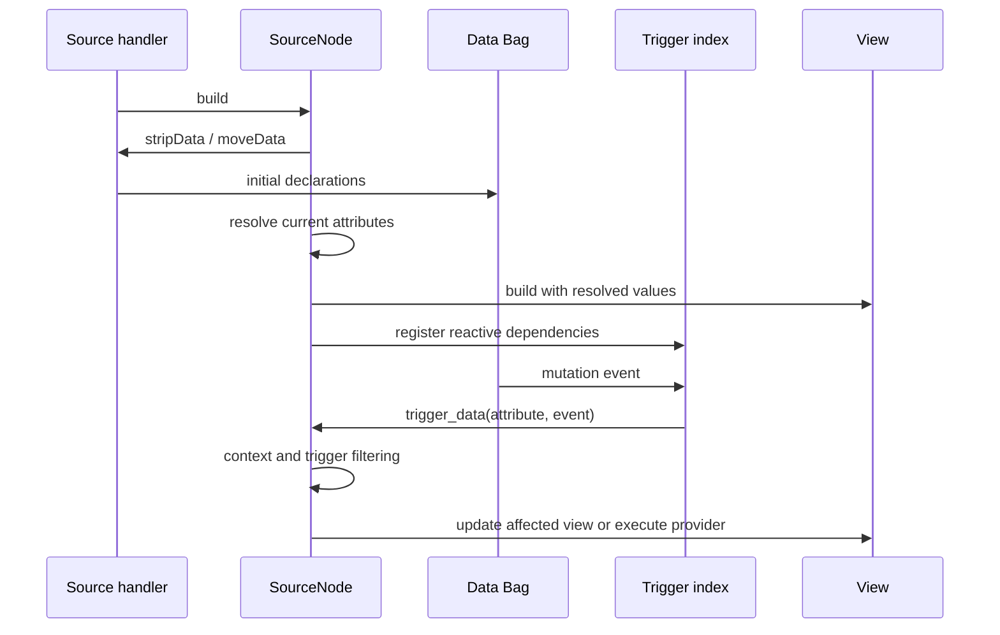

# 160 · SourceNode, Data and provider execution: legacy investigation

> **Historical reference — superseded for execution on 2026-09-25:**
> [GC-210](210-binding-contract.md) records the owner-confirmed 0.2.0 contract
> and phase plan; [GC-070 §490](070-work-status.md#gc-070-490) records current work.
> GC-175 is a historical handoff, not the current checkpoint. The body below
> preserves earlier proposals, observations and dated evidence; its pause/next-step
> language is historical. Legacy data/path quotations do not define the new API.
> Source provenance rules remain valid and do not reopen later owner decisions.

> **Source audit (2026-09-24):** Read [GC-170](170-binding-source-audit.md) first.
> Historical observations and proposed compatibility cases below are not owner
> decisions. Segmented Data is excluded as a requirement; Gramlot may specialize
> Builder bases. Implementation is paused for review of the corrected basis.

Document ID: **GC-160**. Date: **2026-09-24**. Status: investigated, not implemented.
[Concise counterpart](../../docs_llm/internal/160-legacy-binding-flow.md).

## 005 · Scope, authority and evidence

The owner requests an accurate end-to-end recovery, with SourceNode as the context
of relative/symbolic access, GET/SET/PUT/FIRE, delayed calls, dataFormula and
dataController. These belong together from the outset. Public GenroPy behavior
is the compatibility reference; PoC and current dependency code are compared,
not presumed identical. GC-155 module names remain provisional.

Three Sol audits plus the root lifecycle review produced:

- [SourceNode operations and macro compilation](../../ports/PORT-0005-data-binding/legacy-sourcenode-flow.md).
- [Formula/controller execution](../../ports/PORT-0005-data-binding/legacy-logic-flow.md).
- [Delayed execution and cancellation](../../ports/PORT-0005-data-binding/legacy-delayed-flow.md).
- [Mount, freeze and disposal](../../ports/PORT-0005-data-binding/legacy-lifecycle-flow.md).

Reports contain exact paths/line references. Inspected local working trees:
GenroPy HEAD fa35e5adfa6ad1b269f3a22a9b12c4c1ee6513ea, PoC HEAD
10478b57ce3f22e6445eb6b72eba343520cbebac, current Gramlot and installed published
Builder/Bag. These commit IDs identify the checkouts, not a claim that every file
is unchanged from HEAD. Some Python legacy references use the nested sourcerer
checkout; reports name that explicitly. No runtime code was modified.

## 010 · The SourceNode is the execution context

Legacy scripts compile through funcCreate, which expands macro syntax and binds
an execution receiver. SourceNode resolves inherited/current datapath, symbolic
references, data-node attributes and current parameters. Its data operations then
reach the page Data Bag. A binding index only routes candidate events back to the
node; it does not replace the node's semantic context.

GET path is a script macro expanding to this.getRelativeData('path'). It is not
the same public syntax as sourceNode.GET('path'), although both can reach similar
operations. PoC/Builder methods alone do not implement the legacy macro compiler.

| Operation | Legacy effect | Important destination finding |
| --- | --- | --- |
| getRelativeData | Resolve context, optional autocreate/default, pass _sourceNode to Data access | Published default/autocreate signature differs; resolver context is not forwarded |
| SET | Resolve context, write with notification and lazy unchanged-value behavior | Verify origin and equality behavior, not just final value |
| PUT | Write without trigger | Published PUT forwards reason=false but does not disable separate doTrigger; probe observed an event |
| FIRE | Trigger an event then silently reset stored value to null | Published Bag resets the value but lacks fired in its event payload |
| FIRE_AFTER | Macro schedules a fired relative write (10 ms in inspected expansion) | Distinct from node delayedCall and global fireAfter |

Legacy fireEvent, fireItem and FIRE macro have differing defaults for false, zero,
empty and omitted values. Preserve the distinction until executable cases establish
what must be retained; do not normalize them by convenience.

## 015 · Addressing and moving context

Recover ^ reactive, = passive and == inline expression independently. Relative
paths depend on the declaring SourceNode. Include absolute paths, node attribute
?name, parent traversal and symbolic node references. Legacy also handles dynamic
or callable datapaths, aliases, #FORM/#ANCHOR, #ROW/#WORKSPACE/#DATA, node IDs and
Source addressing. Some forms depend on form/widget context and need their own
bounded contract; inventory inclusion is not an invented implementation.

PoC adds builder-segment volumes and volume:path; the published Builder uses a
flat Data namespace and does not parse this form. This is an explicit compatibility
difference, not a reason to silently choose either representation. Both PoC and
published Builder lose ?attr on symbolic path dispatch. Published Builder also
misclassifies == as a passive pointer compared with PoC/legacy expression behavior.

Legacy subscriptions distinguish stable paths (indexed) from movable contexts
(floating candidates re-evaluated on dispatch). A permanently cached absolute path
is insufficient. SourceNode performs final exact/container/child and value/attribute
filtering. Parent, alias or symbolic-target changes must not leave stale readers.

## 020 · Startup to visible values

This diagram summarizes the ordinary flow, not a universal timing assertion for
all startup hooks. Data providers are Source declarations without ordinary DOM.
Legacy _init executes during setup; _onStart reacts to startup Data state;
_onBuilt runs through after-build callbacks. These are not interchangeable. PoC
uses _on_start and explicit startup formula dependency ordering; this is not proof
of legacy equivalence.

PoC supports both setup(data) and Source data/dataSetter declarations. Legacy
moveData has a missing-node/non-null initialization rule. Current Gramlot Host
transmits Source only and does not install the recovered Data execution lifecycle.
Initial Data transport, declaration order, remount and remote-branch behavior need
compatibility cases before choosing a wire format. No automatic server sync follows.

## 025 · Formula/controller propagation

Data mutation -> trigger index -> SourceNode.trigger_data -> provider
setDataNodeValue -> optional delay -> setDataNodeValueDo -> fresh arguments ->
condition/body -> relative Data write -> further triggers and view updates.

- Both ^ and = arguments are read at execution; only ^ registers reactive interest.
  Passive inputs can therefore change the result of a later peer-triggered run.
- Formula evaluates an expression and writes its result. Controller executes a
  script in node context. Legacy supplies named arguments, _kwargs, _node,
  _triggerpars and _reason; direct/subscription arguments participate too.
- _if/_else, _userChanges and distinct startup flags are present in legacy but
  not equivalently implemented in the inspected PoC runtime. Their names and
  semantics must not disappear from the recovery matrix.
- View anti-echo skips the originating reader; it is not a universal prohibition
  on nested controller writes. PoC adds controller recursion guards and deduplicated
  FIFO formulas during live(). Legacy synchronous dispatch does not establish the
  same batching/cycle policy. Existing Gramlot Source FIFO remains approved.
- Typed writeback, composition, focus/selection, null and format concerns from the
  first audit remain part of this flow, not a separate application workaround.

## 030 · Delayed execution is not one timer API

| Mechanism | Ownership and replacement | Sampling/context |
| --- | --- | --- |
| genro.callAfter | Global pending map; same reason replaces prior call | Explicit scope, default genro |
| genro.fireAfter | Same global map, keyed by path | Fires Data event; can collide with callAfter key |
| SourceNode.delayedCall | Per-node _dc_code handle; same code replaces | Legacy passes callback directly; PoC binds node and validates delay |
| Provider _delay | Per-provider pendingFire; latest trigger replaces | Captures latest trigger metadata, rereads bound Data when executing |
| setRelativeData delay / setDataAfter | Independent delayed writes in inspected paths | Not automatically equivalent to keyed debounce |
| _timing / startup hooks | Interval and separate startup scheduling | Distinct cleanup and ordering obligations |

PoC node timers have a per-node map and are canceled on removal/disposal. Inspected
legacy deletion clears intervals/watches, but does not establish cancellation of
all pendingFire or _dc_* handles. Record this as a lifecycle gap to investigate,
not an instruction to reproduce a leak or an assertion of universal cancellation.
Formula queue batching, Source freeze and millisecond delay are three distinct
mechanisms. Zero/auto/default delay, duplicate keys, exceptions and resampling need
separate cases.

## 035 · Removal, freeze and ownership

Source insertion prepares data/providers and registers readers. Replacement/removal
must unregister the old subtree and cancel queued/owned work. Registration handles
must remain removable after the node is detached; recomputing a relative path then
can address the wrong place.

Legacy freeze postpones rebuild but immediately cleans discarded content. Its
trigger index snapshots subscribers because a callback may mutate the Source tree.
Current core mount records, cleanup and FIFO are useful primitives, but neither
Source freeze nor static Builder evaluation implements reactive Data/provider
lifetime. Preserve behavior with tests rather than copying the legacy Dojo machinery.

## 040 · Verification and limits

| Verification | Result and limit |
| --- | --- |
| PoC abs-datapath + reactive-logic | 33 passed in SourceNode audit |
| PoC provider-actions + local-logic + branch-preparation | 24 passed in delay audit |
| PoC provider-actions alone | 8 passed independently; overlaps preceding row |
| Legacy bag_mixin | 34 passed in Node harness |
| Legacy trigger-index/frozen-discard | 8 passed in Node/vm with Dojo stubs |
| Legacy bag_mixin + bagnode_legacy_audit comparison | 39 passed, 7 failed; comparison not verified |
| Published Builder/Bag probe | PUT event observed; repeated FIRE observed with stored value reset to null |

Do not sum overlapping suites. The legacy comparison failure on fireItem occurs
while constructing its selected adapter (`this._nodes.splice is not a function`),
so that failure does not prove a fireItem semantic mismatch. The seven failures
remain unresolved evidence requiring diagnosis. No full legacy browser acceptance
or destination reactive binding test pass is claimed. Logs and commands are cited
in the detailed reports.

## 045 · Consequence for the implementation plan

Start from SourceNode context and the complete Data/provider execution flow.
Keep syntax/path evaluation generic, but resolve owning-library gaps before browser
integration. A private index or scheduler is an implementation aid, not the public
model. Formulas, controllers and delayed operations are in the initial design.

Prepare compatibility cases first for silent PUT, fired metadata, macro versus
method syntax, dynamic/symbolic paths and expression resolution; then startup,
provider conditions/arguments/order, delayed resampling/cancellation and teardown.
For each difference classify: existing approved behavior to recover, implementation
defect, unresolved evidence or a necessary owner-approved incompatibility.

Outstanding gates: resolve the seven legacy comparison failures; establish the
initial-data/wire lifecycle across hosts; record any indispensable deviations;
extend upstream write scope before binding changes in Bag/Builder; preserve and
consolidate the existing 0.1.0 baseline before develop implementation. No runtime
change, branch switch or release was performed by this investigation.
