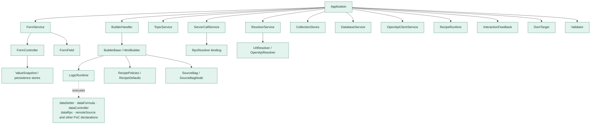
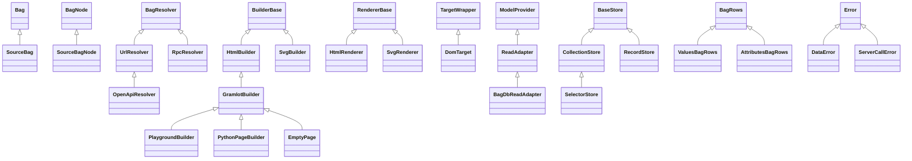
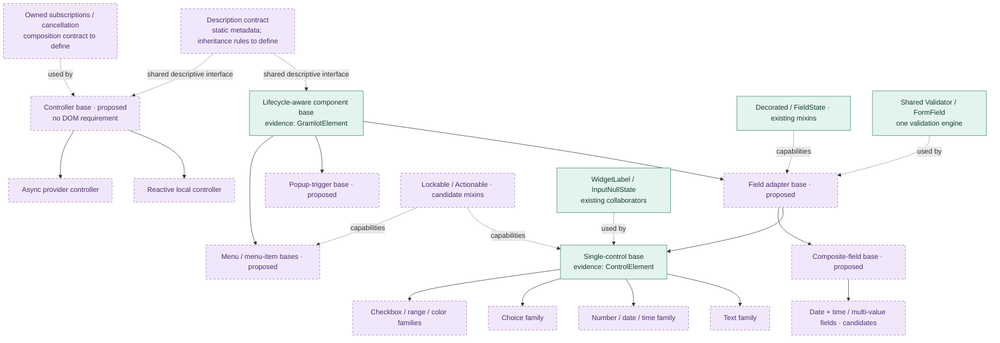
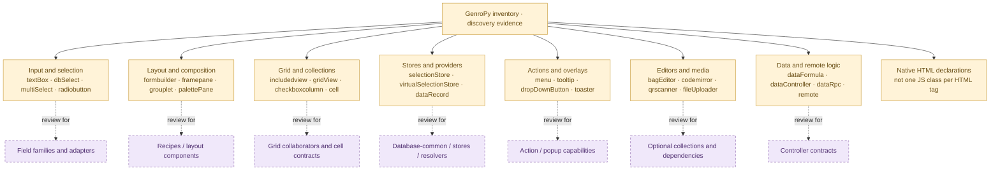
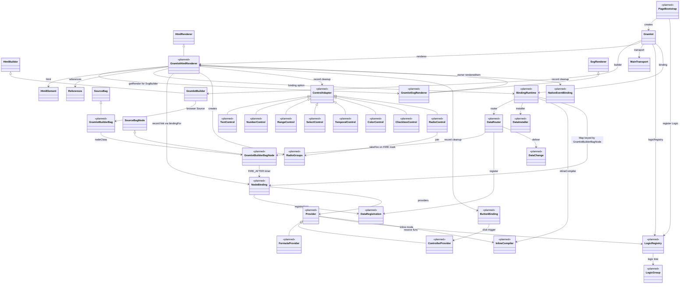

# JavaScript taxonomy, inheritance and composition

Document ID: **GC-045**. Status: **inventory/proposal, not an approved hierarchy**.

**Release scope:** 005–050 = `gramlot-poc` evidence, not core. Core code is **0.1.2**. 055–060 = core runtime classes, current 0.1.2 and planned 0.2.0 binding. **0.2.0 parts are planned and not implemented.**

[Full view](../../docs/internal/045-js-taxonomy.md). [Complete census](050-js-taxonomy-census.md). [Full class tree](diagrams/045-all-classes.mmd).

## 005 · Scope and reading key

PoC 10478b57ce3f22e6445eb6b72eba343520cbebac: 113 parsed JS/mjs files; 112 class constructs + 2 functional mixins; 138 module function declarations (arrow helpers excluded); 38 catalogue entries/10 collections. Legacy: 390 cards (341 component, 20 controller, 17 internal, 11 component/helper, 1 recipe/registration) and 6 curated cards. External dependencies/dynamic classes/other repos not scanned. Legacy 437 declarations/310 registrations and 40 name matches are discovery evidence, not compatibility. Green=PoC, purple=proposal, amber=legacy; class inheritance, mixin application and collaborator use differ.

## 010 · Whole-system taxonomy

Group by responsibilities; collections and capabilities are orthogonal to inheritance. A descriptive contract need not force a universal superclass.

```mermaid
flowchart TB
    ROOT["Gramlot JavaScript · responsibility map"]
    ROOT --> C["Visual components"]
    ROOT --> L["Controllers and declarative logic"]
    ROOT --> R["Recipes and authoring"]
    ROOT --> S["Services and collaborators"]
    ROOT --> D["Data and runtime infrastructure"]
    ROOT --> U["Library utilities"]
    ROOT --> T["Developer tools"]
    C --> CB["GramlotElement / ControlElement"]
    C --> CW["Controls · layouts · grids · trees · editors"]
    L --> LC["LogicRuntime · FormController"]
    L --> LD["dataFormula / dataController / dataRpc<br/>Source declarations, not separate JS classes"]
    R --> RB["BuilderBase → HtmlBuilder / SvgBuilder"]
    R --> RR["RecipeRuntime · Source expansions"]
    S --> SF["FormService · FormField · Validator"]
    S --> SN["TopicService · ServerCallService · ResolverService"]
    D --> DS["SourceBag / SourceBagNode · BuilderHandler"]
    D --> DB["Stores · database contracts · fake adapter"]
    U --> UF["Pointers · formatting · parsing · expression helpers"]
    T --> TI["Inspector · LabSession · DeveloperTools"]
    COL["Collections<br/>distribution and registration axis"] -. groups .-> CW
    MIX["Decorated / FieldState<br/>existing functional mixins"] -. applied to .-> CB
    CAP["Candidate capabilities<br/>lock state · actions · popup ownership"] -. proposed .-> C
    META["Proposed description contract<br/>JS metadata → generated JSON → Python"] -. describes public elements .-> C
    META -. describes public elements .-> L
    classDef root fill:#15324f,color:#fff,stroke:#15324f;
    classDef existing fill:#e3f3ed,color:#143d2e,stroke:#39866b;
    classDef proposal fill:#f0e8fa,color:#4f2e70,stroke:#9670b3,stroke-dasharray:5 4;
    class ROOT root;
    class C,L,R,S,D,U,T,CB,CW,LC,LD,RB,RR,SF,SN,DS,DB,UF,TI,COL,MIX existing;
    class CAP,META proposal;
```

## 015 · Existing component inheritance and actual mixins

GnrInput aliases ControlElement. Exact expression: FieldState(Decorated(GramlotElement)); realm-specific Element defaults to HTMLElement. GroupBox applies Decorated. Factory GnrDbSelect/GnrCheckBoxText retain Base until call-site resolution; catalogue names do not imply distinct classes.

## 020 · Components not yet on the common lifecycle base

Listed classes directly extend HTMLElement. Shared future bases are proposals. Anonymous editor labels describe registered classes. Grid helpers are collaborators, not mixins.

```mermaid
classDiagram
    direction TB
    HTMLElement <|-- GnrPanel
    HTMLElement <|-- GnrBox
    HTMLElement <|-- GnrBorderContainer
    HTMLElement <|-- GnrTab
    GnrTab <|-- GnrContentPane
    HTMLElement <|-- GnrTabContainer
    GnrTabContainer <|-- GnrStackContainer
    HTMLElement <|-- GnrStackButtons
    HTMLElement <|-- GnrFormlet
    HTMLElement <|-- GnrLabledBox
    HTMLElement <|-- GnrForm
    HTMLElement <|-- Palette
    HTMLElement <|-- CopyButton
    HTMLElement <|-- FrameChannel
    HTMLElement <|-- GnrStoreTree
    GnrStoreTree <|-- GnrRelationTree
    GnrStoreTree <|-- FileSystemTree
    HTMLElement <|-- GnrGrid
    HTMLElement <|-- Chart
    HTMLElement <|-- CodeMirrorElement
    HTMLElement <|-- GramlotIde
    HTMLElement <|-- GramlotInspector
    HTMLElement <|-- ProseEditorAnonymous
    HTMLElement <|-- MarkdownEditorAnonymous
    GnrGrid --> GridInteractions
    GnrGrid --> GridBands
    GnrGrid --> GridEditor
    GnrGrid --> GridStatus
    GnrGrid --> GridChangeManager
```

## 025 · Runtime, controllers and services

PoC evidence only; planned 0.2.0 core runtime is in §055. Assembly/use edges, not inheritance. LogicRuntime handles Source declarations; no generic GramlotController hierarchy exists. FormController and InspectorController are specialized.

## 030 · Data, builders, renderers and resolvers

Observed inheritance only. Bag/BagNode/BagResolver external; platform Error/HTMLElement external. Keep form, collection and database stores distinct. PoC database code does not approve dataRecord/dataSelection/general capabilities.

## 035 · Candidate consolidation tree

Candidate families and mixins remain proposals. Preserve existing Decorated/FieldState, compose WidgetLabel/InputNullState/editors, centralize FormField/Validator. Lockable/Actionable/popup and async ownership need review. Bindings stay runtime-owned; utilities remain functions. Static-description AST export is untested: GC-040 used JS execution.

## 040 · GenroPy families feeding the design

Curated representative legacy families; full census preserves all 390 categories/statuses. Syntax-level components can be recipes/helpers. No parity or port commitment.

## 045 · Collections and third-party extension

Ten current collections: inputs, colorpicker, layout, clipboard, palette, storeTree, forms, labEditors, grid, chart. Full view/evidence lists 38 entries. Third parties need identity/version, selected exports, metadata/assets/dependencies and name/tag collision rules. Collections do not determine superclass. GC-040 records tested subset.

## 050 · Sources, regeneration and next review

Regenerate evidence with inventory_js_taxonomy.py and Tree-sitter JS; tool versions in JSON. Syntax errors fail; runtime behavior not tested by parsing. Source evidence and historical proposals in full view. Settle first families, mixin conflicts/order, cleanup ownership and inherited descriptions before bounded ports. No LOT semantics inferred; excluded from public site.

## 055 · Core runtime classes: current 0.1.2 and planned 0.2.0

**0.2.0 part planned, not implemented; current code 0.1.2.** Source: owner-confirmed binding plan, 2026-09-25, revision 3, approved by the owner 2026-09-25 (proposals confirmed "for now"); updated the same date: upstream fixes forbidden; Builder renderers reused by inheritance (revision 4). S00 records it as GC-210 plus a constitution amendment; neither exists yet. Status: [GC-070](070-work-status.md). Core repository, not PoC.

Current 0.1.2: `Gramlot` (`gramlot.js:8-112`) builds `GramlotBuilder`, `data = builder.data`, empty `main` Bag inside `builder.data` (`gramlot.js:14`), `GramlotRenderer`, `MainTransport`; no Data subscription, no binding. `GramlotRenderer extends RendererBase`: `records` Map (line 20), `elements` WeakMap (line 25), one Source subscription (line 27), `pending` FIFO in `receive` (199-229), freeze filter before queuing (201-205). `HtmlElement` writes control `value` (`html.js:131-134`). `References`, `MainTransport` collaborators. `GramlotBuilder.computeLogic()` empty (line 17).

Planned 0.2.0 files: `builder/source.js` (`GramlotBuilderBag`, `GramlotBuilderBagNode`, S01); `binding/runtime.js` (`BindingRuntime`, `NodeBinding`, S03); `binding/router.js` (`DataRouter`, `DataRegistration`, `DataChange`, S04); `binding/installation.js` (`DataInstaller`, S05); `binding/providers.js` (`Provider`, `FormulaProvider`, `ControllerProvider`, S08); `binding/logic.js` (`LogicRegistry`, `LogicGroup`, S07); `binding/inline.js` (`InlineCompiler`, S09); `view/controls.js` (`ControlAdapter` + subclasses, `RadioGroups`, S10-S11); `view/button.js` (`ButtonBinding`, S12); `view/events.js` (`NativeEventBinding`, S12); `bootstrap.js` (`PageBootstrap`, S07); `adapters/resources.js` (`ResourceResolver`, `parseRequires`, S06); `src/gramlot/server/resources.py` (`ResourceResolver`, `parse_requires`, S06); `src/gramlot/collections/binding.json` (S02). No `operations.js`: writes use Source node methods; `setRelativeData`, `getRelativeData`, `SET`, `GET` from Builder; `PUT`, `FIRE`, `FIRE_AFTER`, `absDatapath` from `GramlotBuilderBagNode`.

Planned Source classes (`js/src/builder/source.js`); owner forbids fixes in genro-builders/genro-bag (2026-09-25): `GramlotBuilderBag extends SourceBag`, `nodeClass` → `GramlotBuilderBagNode` (`source-bag.js:252-254`). `GramlotBuilderBagNode extends SourceBagNode`: `PUT(path, value)` silent, `doTrigger=false` (`bag.js:387-389`; Builder `PUT` emits today, `source-bag.js:237`); `FIRE(path, value = true)` opens a `FireMark` on the absolute path, then writes with `fired=true`; router consumes it with `takeFire(path)` at the first event on that path; nested `SET` on the same path during delivery is not fired; mark removed in `finally`; Bag event has no `fired` (`bag.js:601-604`); `FIRE_AFTER(path, value = true, delay = 10)`, timer tracked on `NodeBinding`, cancelled at close; `absDatapath(path)` with variable datapath (`datapath='^.foo'` reads `.foo`; empty → null path, `gnrdomsource.js:735-739`) and `?attr` kept on symbolic paths (today raw datapath, `source-bag.js:132-145`, `?attr` lost). S01 verifies every browser path creates Gramlot classes: JS authoring, `sourceBagFromTytx`, `bindBuilder`, insertion, `remoteSource`; TYTX `SOURCE` suffix is on `SourceBag` today (`builder.py:17-18`); no prototype change. Python does not need them: authoring inert, methods browser-only.

Planned rules: `this.data.setItem('main', new Bag())` (`gramlot.js:14`) disappears. Constructor order `LogicRegistry` → `GramlotBuilder` → `BindingRuntime` → `data` → `binding.attach()` → `source` → `GramlotHtmlRenderer(..., {binding})`. S03bis: `GramlotRenderer extends RendererBase` becomes `GramlotHtmlRenderer extends HtmlRenderer` (DOM `renderedItem`); new `GramlotSvgRenderer extends SvgRenderer` for SvgBuilder nodes, delegating `renderedItem`; inherited `adaptAttrs` brings legacy style shortcuts; `HtmlElement` DOM only. Outer root `main` = document Bag, no copy, one subscription; `gramlot.data === builder.data`; author paths without `main`; router sole subscriber. Parent passes `this`, child getter. Methods in `GramlotBuilderBagNode`/`GramlotBuilderBag` (P17), no prototype change; semantic state stays for now in `NodeBinding`, `Map` of `BindingRuntime` keyed by node; may move onto the node later, no author effect. Semantic lifetime `NodeBinding` (registrations, providers, timers, counter, stamps, `remoteSource` request); DOM lifetime renderer record (`record.cleanup`, `gramlot-renderer.js:84`: element, listeners, controls, button, events). Rebuild closes only DOM lifetime. Registrations at step 4, before the DOM; `renderedItem` only links the record to the open `NodeBinding` (`bindingFor`); `renderer.project` no-op without a record (steps 4-5, freeze). `BindingRuntime` owns `InlineCompiler` (`inlineCompiler`); `==` via `NodeBinding.evaluateFormulas()` → `compileExpression`, every projection. Renderer creates `RadioGroups` (`constructor(renderer)`, view layer); no `radioGroups` on `BindingRuntime`; `binding/` does not import `view/`. `dataSetter` belongs to `DataInstaller`, not a provider. `func` via `LogicRegistry.resolve`, not Builder `_resolveLogicFunc` (static methods only); `GramlotBuilder` unchanged. `LogicGroup` own member only `page`; `gramlot.logic` root = companion; child group per `js_requires` name; `/` nests. `getBaseSourceNode`/`getDomNode` on `GramlotHtmlRenderer` and `Gramlot`, from `records`/`elements`; no added properties.

Diagram source: [045-core-runtime-0.2.0.mmd](diagrams/045-core-runtime-0.2.0.mmd). `<<planned>>` = absent in 0.1.2.

## 060 · Planned 0.2.0 runtime sequences

**Planned, not implemented; current code 0.1.2.**

Branch installation (mount, `remoteSource`, every Source event with a new branch; started by `handleSourceEvent` inside the FIFO): 1 validation without effects; 2 `dataSetter` in document order, R1, active observers see writes synchronously; 3 defaults on empty paths, then `attr_<name>` on the existing Data node of `value`/`src` (legacy rule, no emptiness check, pointer allowed); 4 `openBinding`, `registerPointers`, `Provider.register`; 5 `_init` once; 6 DOM (deferred to thaw under freeze); 7 `_onBuilt`; 8 `_onStart` (page readiness for initial Source, right after 7 for later branches; waits if never built). Error: close new `NodeBinding`s, no Data rollback. Under freeze 1-5 immediately (P3).

Source event entry (P4): 0.1.2 filters freeze before queuing (`gramlot-renderer.js:199-229`). Planned: push unless disposed; return if building; per event in arrival order: drop detached node except `del`; ignore node under construction; semantic work always (`handleSourceEvent`), also under freeze; structural work only outside frozen branches; exception empties `pending` and propagates. Mutations from semantic work run after the current event.

Event matrix: `ins` → install; `del` → `closeBranch` each; `upd_value` old `SourceBag` → close old children; new `SourceBag` → install; new scalar/null → close old branch only; `upd_attrs` → `rebind()`, `rebindBranch` if `datapath`, `_anchor`, `node_id`, `form` or `formId` changed; `upd_value_attr` → close, `upd_attrs`, install.

Data write: document Bag → outer root (`pathlist` starts `main`) → `receiveData` → `DataRouter.deliver` (path, level `node`/`container`/`child`, `fired` via `takeFire(path)` once per event on the mark of `GramlotBuilderBagNode.FIRE`, copied candidates) → `NodeBinding.receive` → `renderer.project` (no-op without element), or `Provider.receive` → `invoke`. Fired at `child` not delivered; `autocreate` ignored. Removal closes semantically also under freeze; thaw builds once, no reinstallation or repeated `_init`/`_onStart`.

Authoring semantics: symbolic `#parent`, `#FORM`, `#ANCHOR`, `#<node_id>` (Builder), `?attr` kept by `absDatapath`; `#WORKSPACE`/`#ROW`/`#DATA` out. Button: one mechanism (P10) among nested `dataController`, `action` (inline, `this` = button), `fire` (`FIRE` modifier string or `true`, Data attrs `modifier`, `_counter`), `fire_<name>` (value `'<name>'`, all fire in order); combinations → error. Control attributes incl. `result_path` excluded from `kwargs` (P20).

Builder behavior missing today (Builder JS 0.1.5 / Bag JS 0.5.3), planned in `GramlotBuilderBagNode`; no fix in genro-builders/genro-bag (§14, owner 2026-09-25): silent `PUT` (today emits, `source-bag.js:237`), S08; `fired` via `FIRE` mark and `takeFire(path)`, not from the Bag event, S04/S08; `FIRE_AFTER(path, value = true, delay = 10)`, timer on `NodeBinding`, S08; variable datapath and symbolic `?attr` in `absDatapath` (today raw value in `_composeRelativeDatapath`), S04. An insufficient Builder/Bag hook → solution in the Gramlot classes, decided with the owner.
