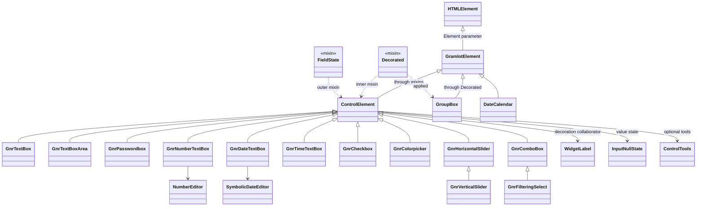
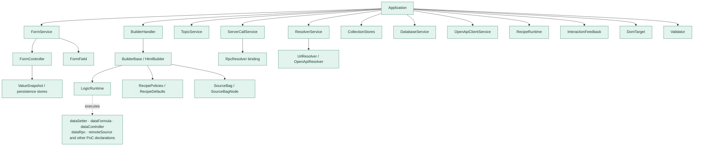
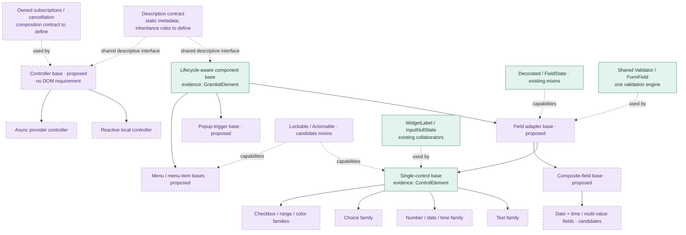
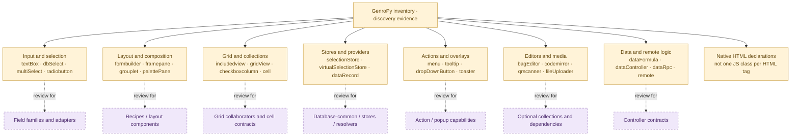

# JavaScript taxonomy, inheritance and composition

Document ID: **GC-045**. Status: **inventory/proposal, not an approved hierarchy**.

[Full view](../../docs/internal/045-js-taxonomy.md). [Complete census](050-js-taxonomy-census.md). [Full class tree](diagrams/045-all-classes.mmd).

## 005 · Scope and reading key

PoC 10478b57ce3f22e6445eb6b72eba343520cbebac: 113 parsed JS/mjs files; 112 class constructs + 2 functional mixins; 138 module function declarations (arrow helpers excluded); 38 catalogue entries/10 collections. Legacy: 390 cards (341 component, 20 controller, 17 internal, 11 component/helper, 1 recipe/registration) and 6 curated cards. External dependencies/dynamic classes/other repos not scanned. Legacy 437 declarations/310 registrations and 40 name matches are discovery evidence, not compatibility. Green=PoC, purple=proposal, amber=legacy; class inheritance, mixin application and collaborator use differ.

## 010 · Whole-system taxonomy

Group by responsibilities; collections and capabilities are orthogonal to inheritance. A descriptive contract need not force a universal superclass.

```mermaid
flowchart TB
    ROOT["Gramlot JavaScript · responsibility map"]
    ROOT --> C["Visual components"]
    ROOT --> L["Controllers and declarative logic"]
    ROOT --> R["Recipes and authoring"]
    ROOT --> S["Services and collaborators"]
    ROOT --> D["Data and runtime infrastructure"]
    ROOT --> U["Library utilities"]
    ROOT --> T["Developer tools"]
    C --> CB["GramlotElement / ControlElement"]
    C --> CW["Controls · layouts · grids · trees · editors"]
    L --> LC["LogicRuntime · FormController"]
    L --> LD["dataFormula / dataController / dataRpc<br/>Source declarations, not separate JS classes"]
    R --> RB["BuilderBase → HtmlBuilder / SvgBuilder"]
    R --> RR["RecipeRuntime · Source expansions"]
    S --> SF["FormService · FormField · Validator"]
    S --> SN["TopicService · ServerCallService · ResolverService"]
    D --> DS["SourceBag / SourceBagNode · BuilderHandler"]
    D --> DB["Stores · database contracts · fake adapter"]
    U --> UF["Pointers · formatting · parsing · expression helpers"]
    T --> TI["Inspector · LabSession · DeveloperTools"]
    COL["Collections<br/>distribution and registration axis"] -. groups .-> CW
    MIX["Decorated / FieldState<br/>existing functional mixins"] -. applied to .-> CB
    CAP["Candidate capabilities<br/>lock state · actions · popup ownership"] -. proposed .-> C
    META["Proposed description contract<br/>JS metadata → generated JSON → Python"] -. describes public elements .-> C
    META -. describes public elements .-> L
    classDef root fill:#15324f,color:#fff,stroke:#15324f;
    classDef existing fill:#e3f3ed,color:#143d2e,stroke:#39866b;
    classDef proposal fill:#f0e8fa,color:#4f2e70,stroke:#9670b3,stroke-dasharray:5 4;
    class ROOT root;
    class C,L,R,S,D,U,T,CB,CW,LC,LD,RB,RR,SF,SN,DS,DB,UF,TI,COL,MIX existing;
    class CAP,META proposal;
```

## 015 · Existing component inheritance and actual mixins

GnrInput aliases ControlElement. Exact expression: FieldState(Decorated(GramlotElement)); realm-specific Element defaults to HTMLElement. GroupBox applies Decorated. Factory GnrDbSelect/GnrCheckBoxText retain Base until call-site resolution; catalogue names do not imply distinct classes.

## 020 · Components not yet on the common lifecycle base

Listed classes directly extend HTMLElement. Shared future bases are proposals. Anonymous editor labels describe registered classes. Grid helpers are collaborators, not mixins.

## 025 · Runtime, controllers and services

Assembly/use edges, not inheritance. LogicRuntime handles Source declarations; no generic GramlotController hierarchy exists. FormController and InspectorController are specialized.

## 030 · Data, builders, renderers and resolvers

Observed inheritance only. Bag/BagNode/BagResolver external; platform Error/HTMLElement external. Keep form, collection and database stores distinct. PoC database code does not approve dataRecord/dataSelection/general capabilities.

## 035 · Candidate consolidation tree

Candidate families and mixins remain proposals. Preserve existing Decorated/FieldState, compose WidgetLabel/InputNullState/editors, centralize FormField/Validator. Lockable/Actionable/popup and async ownership need review. Bindings stay runtime-owned; utilities remain functions. Static-description AST export is untested: GC-040 used JS execution.

## 040 · GenroPy families feeding the design

Curated representative legacy families; full census preserves all 390 categories/statuses. Syntax-level components can be recipes/helpers. No parity or port commitment.

## 045 · Collections and third-party extension

Ten current collections: inputs, colorpicker, layout, clipboard, palette, storeTree, forms, labEditors, grid, chart. Full view/evidence lists 38 entries. Third parties need identity/version, selected exports, metadata/assets/dependencies and name/tag collision rules. Collections do not determine superclass. GC-040 records tested subset.

## 050 · Sources, regeneration and next review

Regenerate evidence with inventory_js_taxonomy.py and Tree-sitter JS; tool versions in JSON. Syntax errors fail; runtime behavior not tested by parsing. Source evidence and historical proposals in full view. Settle first families, mixin conflicts/order, cleanup ownership and inherited descriptions before bounded ports. No LOT semantics inferred; excluded from public site.

