# Gramlot: architettura e guida per collaborare

> **0.2.0 contract update — 2026-09-25:** initial values use
> `dataSetter(destination_path, value=None, **attr)`, not the legacy data declaration;
> `dataFormula(result_path, formula=None, func=None, **params)` and
> `dataController(script=None, func=None, **params)` are the canonical logic signatures.
> See [GC-210](210-binding-contract.md). This is a planned contract, not delivered
> binding; historical component examples and standalone HTML exports retain their
> dated scope and do not establish 0.2.0 support.

**Edizione storica del 18 settembre 2026.** Il core attuale implementa il perimetro limitato HTML nativo e Source live; PoC, binding e ricette restano evidenza o lavoro futuro. Per lo stato corrente vedere [GC-070](070-work-status.md) e per la release [GC-110](110-native-html-readiness.md#gc-110-020).

**GC-055 · Edizione di lavoro · 18 settembre 2026**

Dalle dichiarazioni Python ai componenti JavaScript: responsabilità, composizione,
collezioni e percorso verso il core consolidato.

Guida interna in italiano richiesta dal proprietario. Le proposte sono indicate
come tali; il codice di riferimento è ancora nel PoC.

## 005 · Da dove partire

Gramlot consolida il framework; il codice corrente è nel PoC. Distinguere esistente, esperimento, proposta e legacy. Costituzione autorevole; nessuna semantica LOT formale approvata.

## 010 · Source, Data e DOM: tre responsabilità

Source descrive struttura e comportamento, Data Bag contiene stato, DOM è la rappresentazione. Non ogni nodo Source produce DOM. Usare binding, controller e resolver del framework.

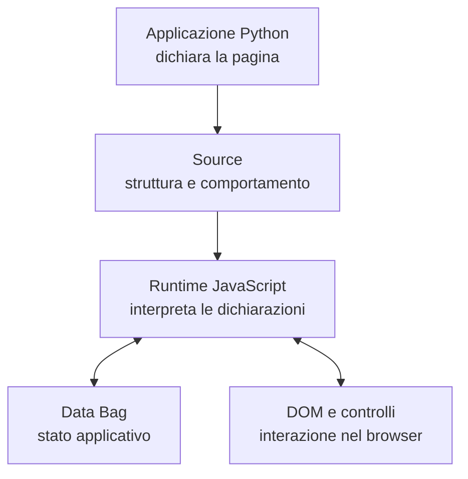

## 015 · Che cosa succede quando si usa una pagina

Python costruisce Source, il runtime JS esegue. L’editing locale non riesegue automaticamente Python e non salva automaticamente nel database. Il commit segue il contratto del controllo.

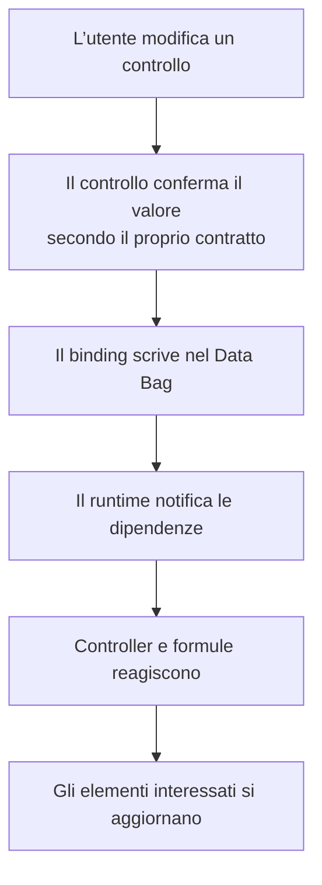

## 020 · Una tassonomia per orientarsi

Famiglie: componenti, controller/logica, builder/recipe, servizi, collaboratori, dati/infrastruttura, utility e strumenti. Un tag dichiarativo non implica una classe dedicata.

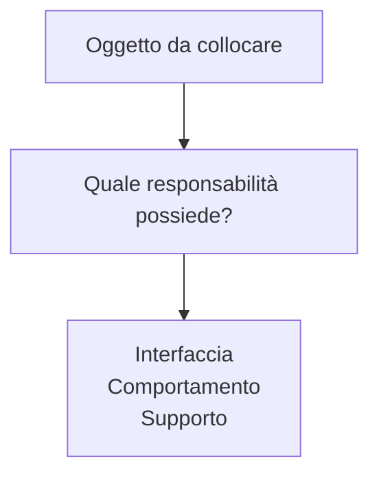

## 025 · Classi base: il nucleo visuale esistente

Basi esistenti per realm: GramlotElement e ControlElement. Espressione effettiva FieldState(Decorated(GramlotElement)); GnrInput è un alias. I gruppi del diagramma non sono nuove basi.

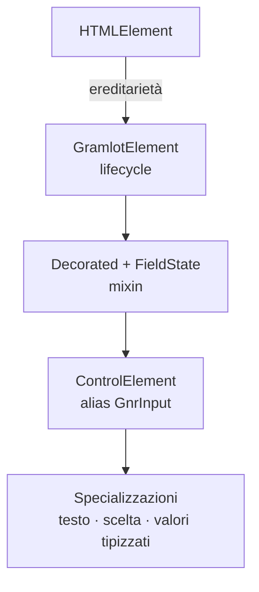

## 030 · Specializzazioni e componenti ancora separati

Molti layout, alberi, griglie ed editor derivano direttamente da HTMLElement. Factory Base richiedono analisi dei call site. Nessuna gerarchia uniforme già realizzata.

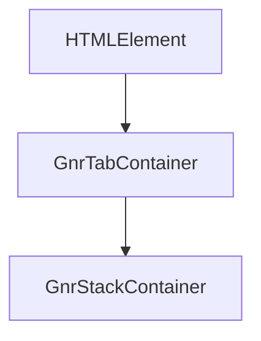

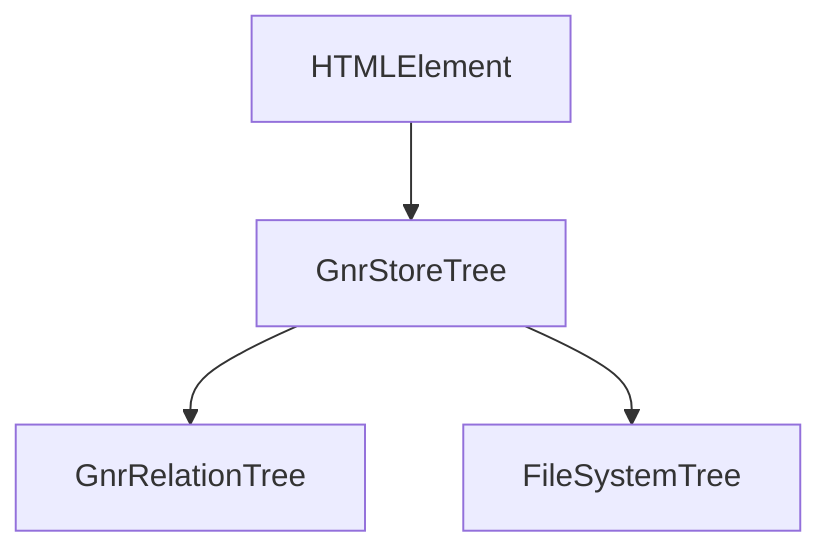

## 035 · Mixin, collaboratori e utility: come scegliere

Decorated/FieldState sono mixin; WidgetLabel/InputNullState/editor sono collaboratori; utility restano funzioni. Definire ordine, membri, conflitti, proprietari e cleanup. Validazione condivisa.

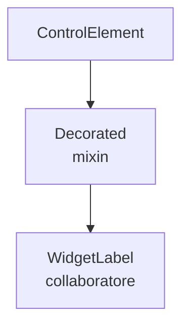

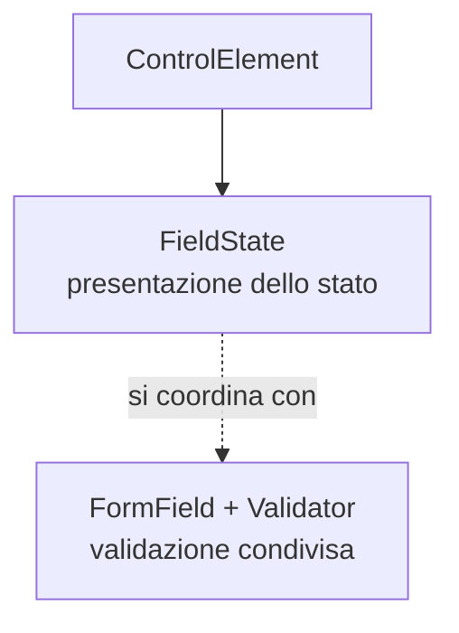

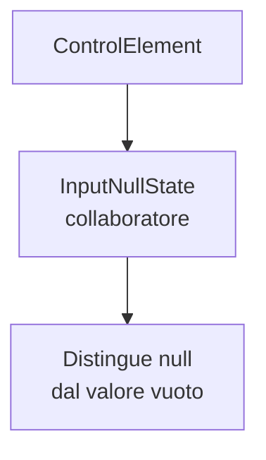

## 040 · Controller, servizi e operazioni asincrone

Application assembla servizi; BuilderHandler/LogicRuntime coordinano dichiarazioni. FormController/InspectorController sono specializzati. Base controller generale proposta; async richiede cancellazione e rifiuto risultati obsoleti.

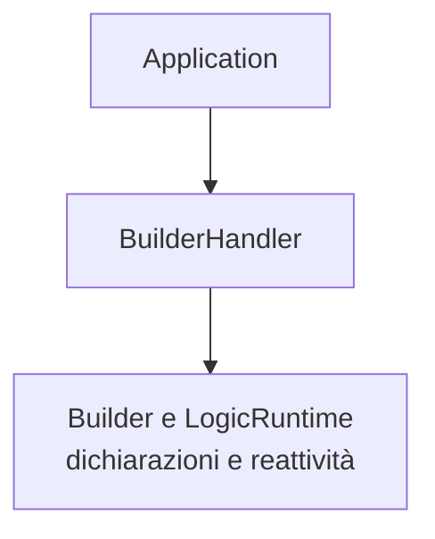

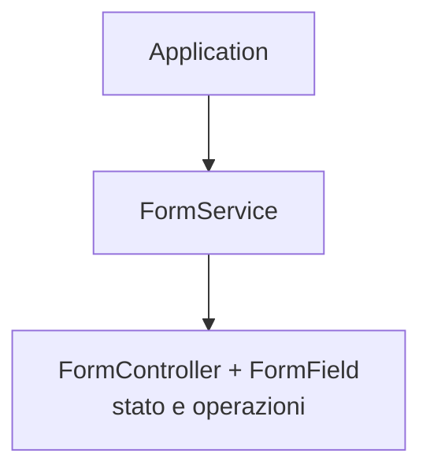

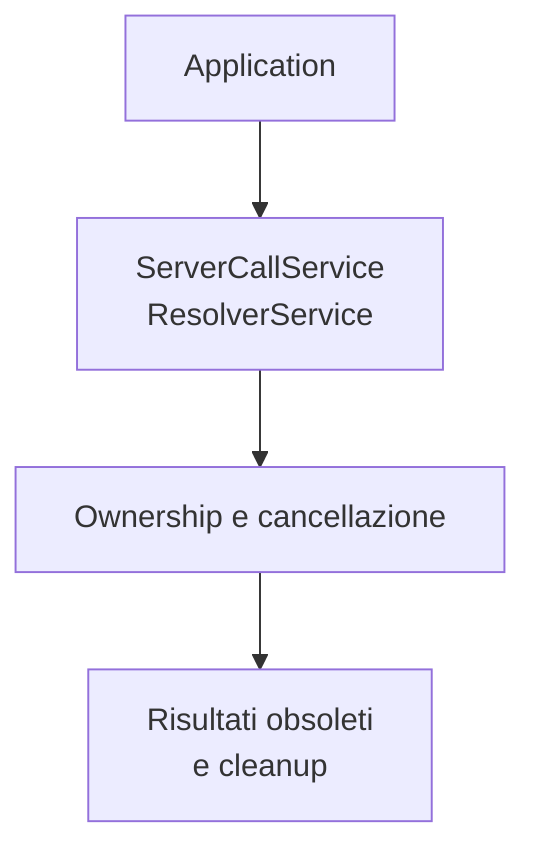

## 045 · Componenti scritti in JS, applicazioni scritte in Python

Esperimento JS→JSON→Python→runtime riuscito: 4 test Python, 3 Node/jsdom e 4 test esistenti. Nessun test browser reale/package install. Descrizione statica di classe/describe e composizione ereditaria ancora da definire.

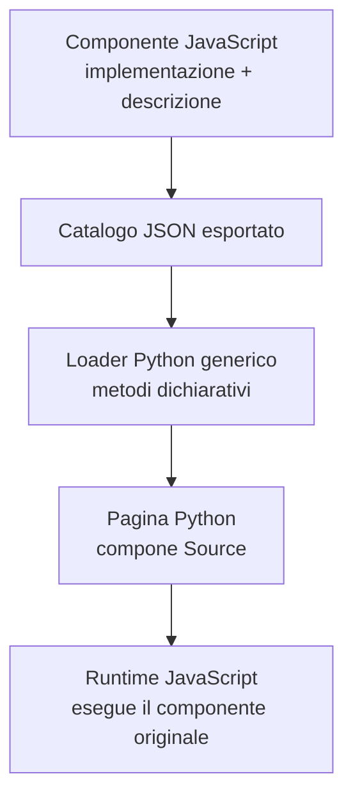

## 050 · AST, build e CI: dove nasce il catalogo

Sourcerer usa Tree-sitter JS da Python; estrazione metadati ereditati non verificata. AST statico e describe eseguito sono alternative. Build/CI genera artefatti senza commit automatici. Pacchetti con JSON+JS; niente Node richiesto al server Python.

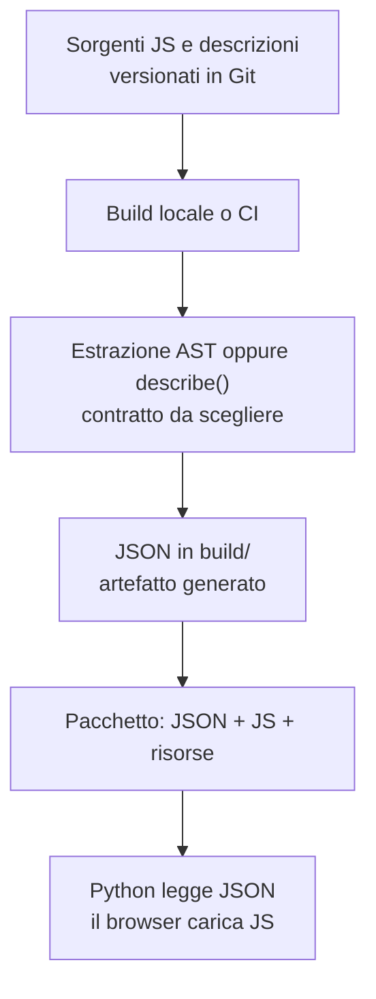

## 055 · Collezioni ed estensioni di terzi

10 collezioni/38 descrizioni. Collezione distinta da ereditarietà. Terzi: identità/versione, export, dipendenze, asset, compatibilità. Conflitti Python/tag DOM espliciti. Versioni simultanee, lazy loading e cicli non testati.

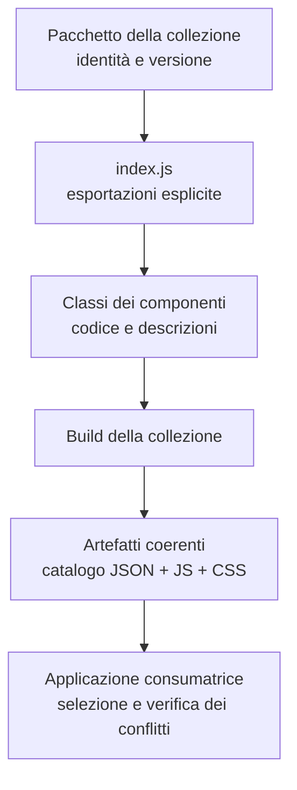

## 060 · Server e database: due scelte indipendenti

Host e database indipendenti. Core senza dipendenze host. Database common/fake/genropy/sqlalchemy; SQLite via SQLAlchemy. Presenza di classi PoC non approva dataRecord/dataSelection/protocollo capacità.

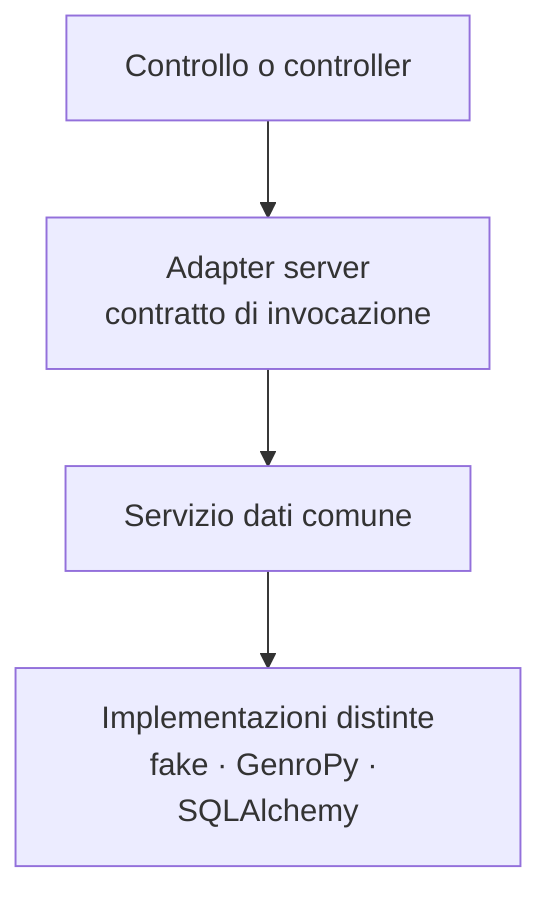

## 065 · Che cosa impariamo dall’inventario GenroPy

390 schede da due alberi Python legacy, non audit completo JS. Nomi uguali non provano parità. Riclassificare helper/composizioni per comportamento, evitando trasferimento automatico dei vincoli Dojo.

## 070 · Come può evolvere la gerarchia

Proposta: lifecycle base, campo singolo/composto, eventuali popup/menu e controller. Lockable/Actionable candidati. Descrizione comune non richiede superclasse universale. Non creare classi vuote prima delle prove.

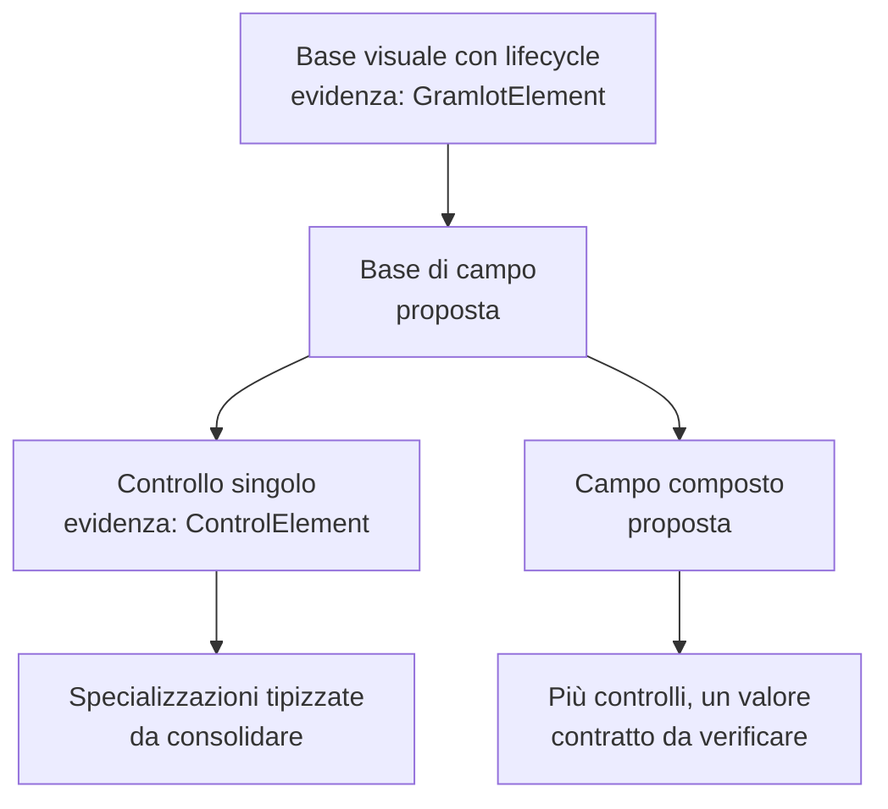

## 075 · Come lavorare insieme sul consolidamento

Port piccoli con revisione, contratto, dipendenze, test, differenze e feedback. Ownership Data/risorse, errori e lifecycle espliciti. Demo Gramlot con sorgente/Inspector. Develop→main dopo verifica; pubblicazioni separate.

## 080 · Verifiche, coverage e decisioni ancora aperte

Coverage JS separata da Python, includendo file non importati; esclusi vendor/generati/helper. Node/jsdom distinto da browser. Aperte descrizioni/mixin, estrattore, packaging/versioni, basi e adapter. Primo traguardo: sequenza completa e piccola.

## 085 · Fonti e perimetro del documento

Baseline 10478b57ce3f22e6445eb6b72eba343520cbebac: 113 file, 112 classi+2 mixin, 138 funzioni modulo, 38 descrizioni/10 collezioni, 390 schede legacy+6 curate. Dipendenze/dinamico/altri repo esclusi. Esperimento locale non nella baseline. HTML offline; fonti esterne richiedono rete.

## 090 · Appendici consultabili

Inventari completi nelle appendici della versione estesa e nel JSON GC-045.
