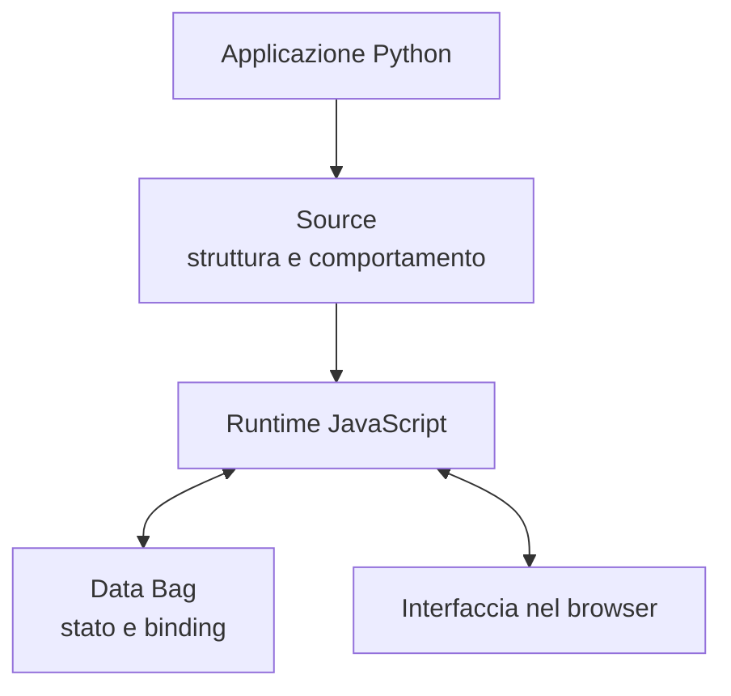
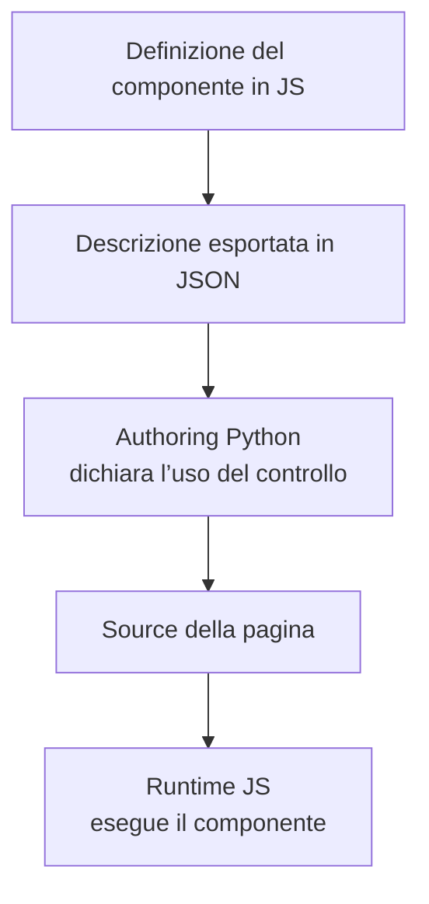
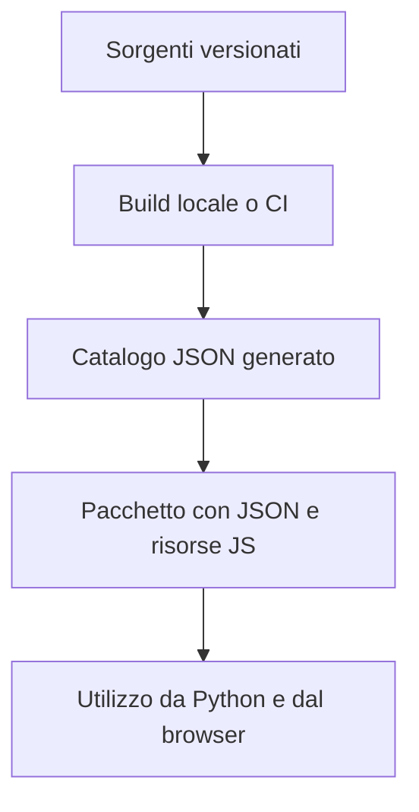

# Gramlot: l’architettura condivisa

**Edizione storica del 18 settembre 2026.** Il core attuale implementa il perimetro limitato HTML nativo e Source live; PoC, binding e ricette restano evidenza o lavoro futuro. Per lo stato corrente vedere [GC-070](070-work-status.md) e per la release [GC-110](110-native-html-readiness.md#gc-110-020).

**GC-060 · Guida essenziale per collaborare · 18 settembre 2026**

**Release 0.2.0:** il codice attuale è la **0.1.2**. La sezione 045 descrive l’architettura del binding HTML/SVG della 0.2.0. **Le parti 0.2.0 sono pianificate e non implementate.**

Questo documento raccoglie i principi concordati e la direzione di lavoro condivisa.
I diagrammi descrivono responsabilità e flussi, non una gerarchia definitiva di classi.

## 005 · Un framework, una destinazione

Gramlot è la destinazione definitiva; implementazione temporanea in gramlot-poc. Consolidare comportamento, responsabilità, test e documenti per incrementi revisionati. Main consolidato, develop per lavoro da verificare.

## 010 · Python descrive l’applicazione, JavaScript la fa funzionare

Python autore principale; JS runtime browser. Source descrive, Data contiene stato, binding collega, controller reagisce, resolver procura dati, componente espone controllo. Non tutti i nodi producono DOM. Nessun sistema applicativo parallelo: colmare le lacune nel framework.

## 015 · Il componente si definisce in JavaScript

Direzione condivisa: definizione e descrizione del componente in JS; JSON consumato da Python per dichiarare controlli senza wrapper manuali per ogni componente. JSON descrittivo distinto da implementazione; distribuzione coerente con JS.

## 020 · Il catalogo è un artefatto di build

Catalogo generato dai sorgenti in build locale/CI, non mantenuto a mano. Generazione non implica commit/push. Pacchetto con JSON e risorse JS; Python legge senza eseguire JS sul server.

## 025 · Riuso: basi, mixin e funzioni comuni

Basi per contratti comuni, mixin per capacità, servizi/collaboratori per comportamento e risorse, utility come libreria, recipe per Source. Esplicitare dipendenze, scritture Data, lifecycle, cleanup, errori/conflitti e isolamento. Distinguere authoring Python, browser JS e server; controparti solo per superfici/contratti condivisi.

## 030 · Collezioni e contributi esterni

Collezioni organizzano ed espongono oggetti e consentono contributi esterni; non sono superclassi. Estensioni con definizione JS, descrizione per Python e contratti condivisi. Ruoli distinti anche nelle collezioni esterne.

## 035 · Server e database restano indipendenti

Core indipendente da server/database, integrazioni per host/backend. Database common/fake/genropy/sqlalchemy; SQLite via SQLAlchemy. Estensioni specifiche non diventano requisiti universali.

## 040 · Come si consolida un contributo

Port accettati con contratto/codice/test/docs allineati; registrare limiti, differenze e feedback. Coverage JS distinta da Python e riferita alla revisione misurata. Test accompagnano il codice. Docs pubbliche per sviluppatori, architettura interna. Pubblicazione distinta da consolidamento.

## 045 · Binding HTML/SVG nella 0.2.0: architettura pianificata

**Pianificato, non implementato; codice attuale 0.1.2.** Fonte: piano binding 0.2.0 confermato dall'owner il 2026-09-25; S00 lo registra come GC-210 e amendment. Dettaglio in inglese: [GC-045 §055](045-js-taxonomy.md#gc-045-055), [§060](045-js-taxonomy.md#gc-045-060), [GC-087 §085](087-javascript-layer-boundaries.md#gc-087-085), [GC-065 §030](065-host-adapters.md#gc-065-030).

0.1.2: dichiarazioni inerti, nessun binding. 0.2.0: radice esterna → `main` = Bag del documento, una sottoscrizione, un `DataRouter`, path senza `main`; `NodeBinding` = durata semantica, record del renderer = durata DOM, nessuna sottoclasse di `SourceBagNode`; installazione in 8 passi (validazione, `dataSetter`, default, registrazione, `_init`, DOM, `_onBuilt`, `_onStart`); eventi Source in FIFO, lavoro semantico anche sotto freeze; logica per nome primaria (`LogicRegistry`, `LogicGroup`), inline solo nel runtime della pagina; scritture con i metodi del nodo Source di Builder; `css_requires`/`js_requires` al posto di `Page.css`, `PageBootstrap`; correzioni upstream U1-U4 necessarie, oggi assenti, nessun sostituto locale.
