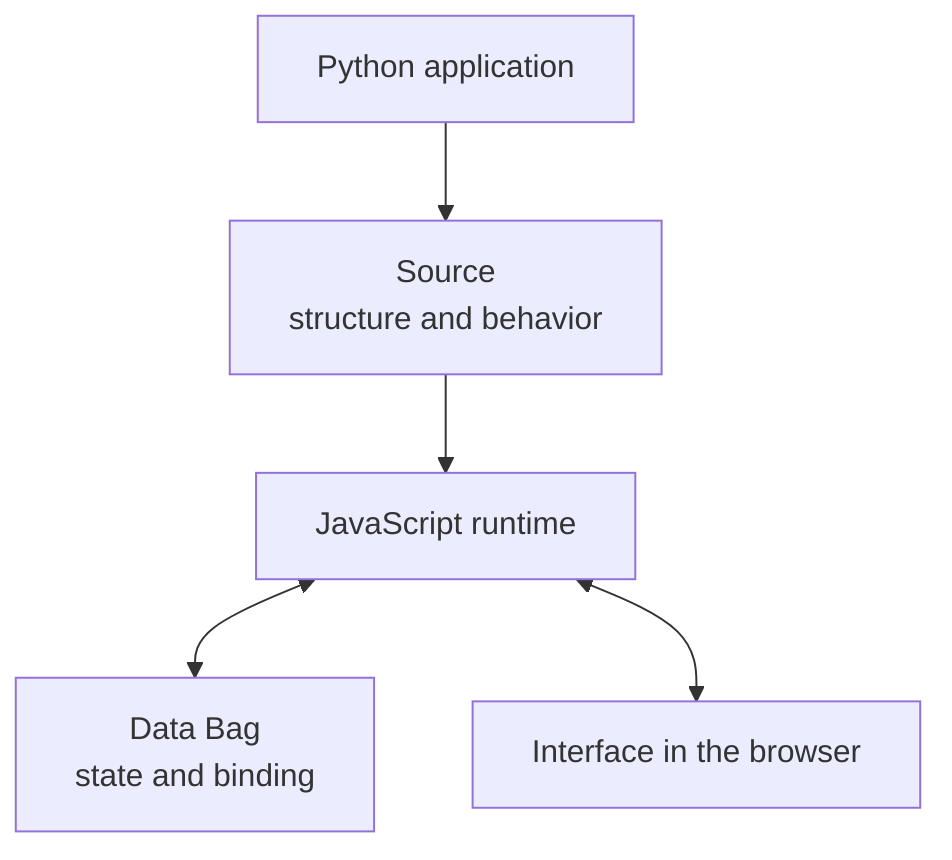
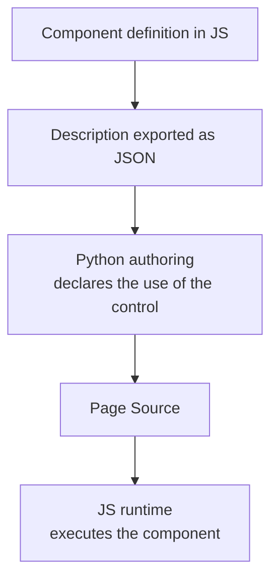
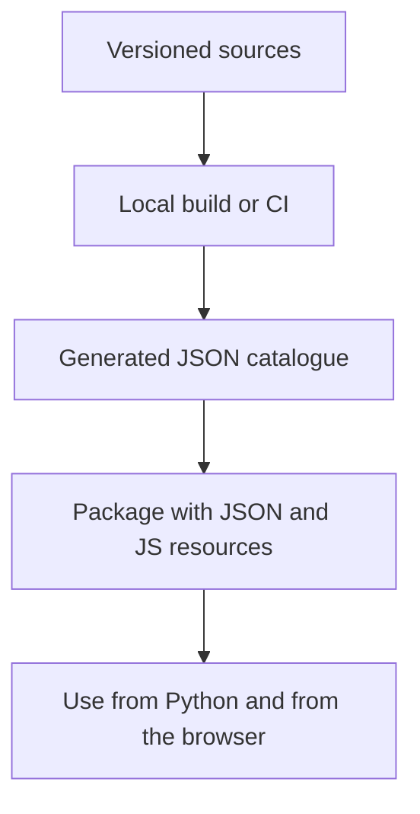

# Gramlot: the shared architecture

**Historical edition of 18 September 2026.** The current core implements the bounded native HTML and live Source scope; PoC, bindings and recipes remain evidence or future work. For the current status see [GC-070](070-work-status.md) and for the release [GC-110](110-native-html-readiness.md#gc-110-020).

**GC-060 · Essential guide for collaborating · 18 September 2026**

**Release 0.2.0:** the current code is **0.1.2**. Section 045 describes the architecture of the 0.2.0 HTML/SVG binding. **The 0.2.0 parts are planned and not implemented.**

This document collects the agreed principles and the shared direction of work.
The diagrams describe responsibilities and flows, not a final class hierarchy.

## 005 · One framework, one destination

Gramlot is the final destination; temporary implementation in gramlot-poc. Consolidate behavior, responsibilities, tests and documents through reviewed increments. Main consolidated, develop for work to verify.

## 010 · Python describes the application, JavaScript makes it work

Python main author; JS browser runtime. Source describes, Data holds state, binding connects, controller reacts, resolver obtains data, component exposes a control. Not all nodes produce DOM. No parallel application system: fill the gaps in the framework.

## 015 · The component is defined in JavaScript

Shared direction: component definition and description in JS; JSON consumed by Python to declare controls without manual wrappers for each component. Descriptive JSON distinct from implementation; distribution consistent with JS.

## 020 · The catalogue is a build artifact

Catalogue generated from sources in local build/CI, not maintained by hand. Generation does not imply commit/push. Package with JSON and JS resources; Python reads without executing JS on the server.

## 025 · Reuse: bases, mixins and common functions

Bases for common contracts, mixins for capabilities, services/collaborators for behavior and resources, utilities as library, recipes for Source. Make explicit dependencies, Data writes, lifecycle, cleanup, errors/conflicts and isolation. Distinguish Python authoring, browser JS and server; counterparts only for shared surfaces/contracts.

## 030 · Collections and external contributions

Collections organize and expose objects and allow external contributions; they are not superclasses. Extensions with JS definition, description for Python and shared contracts. Distinct roles also in external collections.

## 035 · Server and database remain independent

Core independent of server/database, integrations for host/backend. Database common/fake/genropy/sqlalchemy; SQLite via SQLAlchemy. Specific extensions do not become universal requirements.

## 040 · How a contribution is consolidated

Ports accepted with contract/code/tests/docs aligned; record limits, differences and feedback. JS coverage distinct from Python and tied to the measured revision. Tests accompany the code. Public docs for developers, architecture internal. Publishing distinct from consolidation.

## 045 · HTML/SVG binding in 0.2.0: planned architecture

**Planned, not implemented; current code 0.1.2.** Source: 0.2.0 binding plan confirmed by the owner on 2026-09-25; S00 records it as GC-210 and amendment. Detail in English: [GC-045 §055](045-js-taxonomy.md#gc-045-055), [§060](045-js-taxonomy.md#gc-045-060), [GC-087 §085](087-javascript-layer-boundaries.md#gc-087-085), [GC-065 §030](065-host-adapters.md#gc-065-030).

0.1.2: inert declarations, no binding. 0.2.0: outer root → `main` = document Bag, one subscription, one `DataRouter`, paths without `main`; `NodeBinding` = semantic lifetime, renderer record = DOM lifetime, no subclass of `SourceBagNode`; installation in 8 steps (validation, `dataSetter`, defaults, registration, `_init`, DOM, `_onBuilt`, `_onStart`); Source events in FIFO, semantic work also under freeze; named logic primary (`LogicRegistry`, `LogicGroup`), inline only in the page runtime; writes with the Builder Source node methods; `css_requires`/`js_requires` instead of `Page.css`, `PageBootstrap`; upstream fixes U1-U4 required, absent today, no local substitute.
